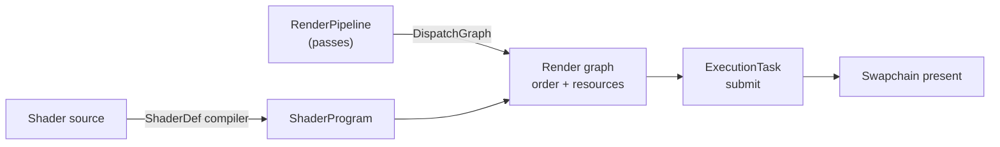

# Graphite Documentation

Prowl.Graphite is a low-level graphics and compute abstraction for .NET with a Vulkan backend. These docs cover both how to use it and how it works inside.

- [Where to start](#where-to-start)
- [Big picture](#big-picture)
- [Internals](#internals)
- [API reference](#api-reference)
- [Repository layout](#repository-layout)

## Where to start

| You want to... | Read |
| --- | --- |
| Get a triangle on screen | [Getting Started](api/getting-started.md) |
| Understand the whole system at a glance | [Architecture](internals/01-architecture.md) |
| Write passes and build a frame | [Render Graph API](api/render-graph.md), then [Render Graph internals](internals/03-render-graph.md) |
| Write shaders | [ShaderDef format](api/shaderdef.md), then [Shader Programs API](api/shader-programs.md) |
| Debug a crash or a slow frame | [Diagnostics](api/diagnostics.md) |
| Work on the Vulkan backend | [Vulkan Backend](internals/07-vulkan-backend.md) |

## Big picture

## Internals

Why Graphite is built the way it is, and how control moves through it.

1. [Architecture](internals/01-architecture.md) - layers, Core vs backend, the life of a frame
2. [Device and Execution](internals/02-device-and-execution.md) - device lifecycle, ExecutionTask ring, transient memory, sync
3. [Render Graph](internals/03-render-graph.md) - pass ordering, transient/shared/history resources, barriers
4. [Resource Binding](internals/04-resource-binding.md) - PropertySet and PropertyID down to descriptor sets
5. [Programs and Pipelines](internals/05-programs-and-pipelines.md) - the monolithic ShaderProgram, pipeline caching, variants
6. [Shader Compiler](internals/06-shader-compiler.md) - the ShaderDef compile workflow
7. [Vulkan Backend](internals/07-vulkan-backend.md) - init, submission, memory, descriptors, swapchain
8. [Validation and Profiling](internals/08-validation-and-profiling.md) - how the optional layers hook in

## API reference

Public types, their members, and example usage.

| Page | Covers |
| --- | --- |
| [Getting Started](api/getting-started.md) | First app, end to end |
| [Graphics Device](api/graphics-device.md) | GraphicsDevice, GraphicsDeviceOptions, Swapchain, ExecutionTask, Fence |
| [Buffers and Textures](api/buffers-and-textures.md) | DeviceBuffer, Texture, TextureView, Sampler, RenderTexture, Framebuffer, PixelFormat |
| [Command Buffers](api/command-buffers.md) | CommandBuffer, TransferCommandBuffer |
| [Property Sets](api/property-sets.md) | PropertySet, PropertyID |
| [Shader Programs](api/shader-programs.md) | ShaderProgram, GraphicsProgram, ComputeProgram, pipeline state descriptions |
| [Render Graph](api/render-graph.md) | RenderPipeline, IPass, IPresentPass, builders, RenderContext |
| [ShaderDef](api/shaderdef.md) | Shader file format, compiler API, SlangQuickCompile |
| [Diagnostics](api/diagnostics.md) | Validation layers and profiling |

## Repository layout

| Path | Contents |
| --- | --- |
| [Graphite/Core](../Graphite/Core) | Backend-agnostic public API |
| [Graphite/Platform/Vulkan](../Graphite/Platform/Vulkan) | Vulkan implementation of Core |
| [Graphite/ValidationLayers](../Graphite/ValidationLayers) | Optional runtime validation |
| [Graphite/Profiling](../Graphite/Profiling) | Optional runtime profiling |
| [ShaderDef/Core](../ShaderDef/Core) | Shader definition data model used at runtime |
| [ShaderDef/Compiler](../ShaderDef/Compiler) | Shader source compiler (Slang based) |
| [Samples](../Samples) | HelloTriangle, TexturedQuad, Cube, CubeGrid, PBRRenderer |
| [Tests](../Tests) | CPU, GPU and ShaderDef test suites |
| [Tools](../Tools) | GraphiteBench, SlangQuickCompile |
