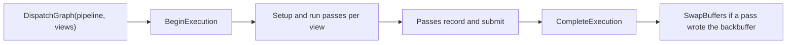

# Getting Started

Build a minimal Graphite app, MyTriangleApp, that clears the window and draws one colored triangle.

- [Project setup](#project-setup)
- [The shader](#the-shader)
- [The app](#the-app)
- [How it works](#how-it-works)
- [Next steps](#next-steps)

## Project setup

Graphite targets `net10.0` and needs a Vulkan-capable GPU and driver. MyTriangleApp references the library, the ShaderDef compiler and the math library. The ShaderDef compiler project already pulls in the ShaderDef core project.

```xml
<Project Sdk="Microsoft.NET.Sdk">
    <PropertyGroup>
        <TargetFramework>net10.0</TargetFramework>
        <OutputType>Exe</OutputType>
        <Nullable>enable</Nullable>
    </PropertyGroup>

    <ItemGroup>
        <ProjectReference Include="../Graphite/Graphite/Prowl.Graphite.csproj" />
        <ProjectReference Include="../Graphite/ShaderDef/Compiler/Prowl.Graphite.ShaderDef.Compiler.csproj" />
        <ProjectReference Include="../Vector/Vector/Vector.csproj" />
    </ItemGroup>
</Project>
```

The paths assume the Anthology checkout sits next to your project. The packages are named `Prowl.Graphite`, `Prowl.Graphite.ShaderDef.Compiler` and `Prowl.Vector`. Graphite brings the Silk.NET Vulkan bindings along, which is where `IVkSurface` comes from. You also need a windowing library that can give you a Vulkan surface.

## The shader

Save this next to the executable as `Triangle.shader`. The file format is covered in [ShaderDef](shaderdef.md).

```
Shader "MyTriangleApp/Triangle"
{
    Pass
    {
        Name "Triangle"

        Cull Off
        ZTest Disabled
        ZWrite Off

        SLANGPROGRAM
        struct VertexInput
        {
            float3 position : POSITION0;
            float4 color : COLOR0;
        }

        struct VertexOutput
        {
            float4 clipPosition : SV_Position;
            float4 color : COLOR0;
        }

        [shader("vertex")]
        VertexOutput Vertex(VertexInput input)
        {
            VertexOutput output;
            output.clipPosition = float4(input.position, 1.0);
            output.color = input.color;
            return output;
        }

        [shader("fragment")]
        float4 Fragment(VertexOutput input) : SV_Target
        {
            return input.color;
        }
        ENDSLANG
    }
}
```

## The app

The listing below is the whole program. `YourWindow` stands in for any windowing library that can expose an `IVkSurface`, its pixel size, a resize notification and an open/closed flag.

```csharp
using System;
using System.IO;

using Silk.NET.Core.Contexts;

using Prowl.Graphite;
using Prowl.Graphite.RenderGraph;
using Prowl.Graphite.ShaderDef;
using Prowl.Graphite.ShaderDef.Compiler;
using Prowl.Vector;


namespace MyTriangleApp;


internal readonly struct SceneView : IRenderView
{
    public SceneView(uint width, uint height)
    {
        PixelWidth = width;
        PixelHeight = height;
    }

    public uint PixelWidth { get; }
    public uint PixelHeight { get; }
    public int ViewId => 0;
}


internal sealed class TriangleMesh : IDisposable
{
    private readonly DeviceBuffer _positions;
    private readonly DeviceBuffer _colors;

    public VertexSource Source { get; }

    public TriangleMesh(GraphicsDevice device)
    {
        Float3[] positions =
        [
            new Float3(0.0f, -0.5f, 0.0f),
            new Float3(0.5f, 0.5f, 0.0f),
            new Float3(-0.5f, 0.5f, 0.0f)
        ];

        Float4[] colors =
        [
            new Float4(1, 0, 0, 1),
            new Float4(0, 1, 0, 1),
            new Float4(0, 0, 1, 1)
        ];

        _positions = device.ResourceFactory.CreateBuffer(
            new BufferDescription((uint)(positions.Length * 12), BufferUsage.VertexBuffer));
        _colors = device.ResourceFactory.CreateBuffer(
            new BufferDescription((uint)(colors.Length * 16), BufferUsage.VertexBuffer));

        device.UpdateBuffer(_positions, 0, positions);
        device.UpdateBuffer(_colors, 0, colors);

        Source = new VertexSource()
            .SetBuffer("POSITION0", _positions)
            .SetBuffer("COLOR0", _colors);
    }

    public void Dispose()
    {
        _positions.Dispose();
        _colors.Dispose();
    }
}


internal sealed class TrianglePass : RasterPass<SceneView>
{
    private readonly TriangleMesh _mesh;
    private readonly ShaderPass _shader;

    public TrianglePass(TriangleMesh mesh, ShaderPass shader)
    {
        _mesh = mesh;
        _shader = shader;
    }

    public override string Name => "Triangle";

    public override void Setup(RenderContextBuilder builder) => SetBackbufferTarget(builder, TargetLoadStoreOps.Clear(new Color(0.10f, 0.12f, 0.16f, 1.0f)));

    public override void Render(RenderContext<SceneView> context)
    {
        CommandBuffer cmd = context.GetCommandBuffer("Triangle");
        BindTarget(context, cmd);
        cmd.SetShader(_shader);
        cmd.SetVertexSource(_mesh.Source);
        cmd.Draw(3);
        context.SubmitCommandBuffer(cmd);
    }
}


internal sealed class TrianglePipeline : RenderPipeline<SceneView>
{
    private readonly TrianglePass _pass;

    public TrianglePipeline(TrianglePass pass) => _pass = pass;

    protected override void InitializePasses() => AddPass(_pass);
}


internal sealed class TriangleApp : IDisposable
{
    private readonly GraphicsDevice _device;
    private readonly TriangleMesh _mesh;
    private readonly TrianglePipeline _pipeline;
    private readonly SceneView[] _views;

    public TriangleApp(IVkSurface surface, uint width, uint height)
    {
        GraphicsDeviceOptions options = new()
        {
            VulkanValidationLayers = true
        };

        SwapchainDescription swapchain = new()
        {
            Width = width,
            Height = height,
            SyncToVerticalBlank = true,
            Source = SwapchainSource.CreateVulkan(surface)
        };

        _device = GraphicsDevice.CreateVulkan(options, swapchain);

        SlangShaderCompiler compiler = new();
        compiler.RegisterModule(new VulkanCompiler("spirv_1_4"));
        compiler.BeginSession([new DirectoryInfo(AppContext.BaseDirectory)]);

        ShaderDefinition definition = ShaderParser.Parse(File.ReadAllText("Triangle.shader"));
        definition.Create(_device, compiler, new Variant(), CompileMode.All);

        compiler.EndSession();

        _mesh = new TriangleMesh(_device);
        _pipeline = new TrianglePipeline(new TrianglePass(_mesh, definition.Passes![0]));
        _views = [new SceneView(width, height)];
    }

    public void Frame() => _device.DispatchGraph(_pipeline, _views);

    public void Resize(uint width, uint height)
    {
        if (width == 0 || height == 0)
            return;

        _device.ResizeMainWindow(width, height);
        _views[0] = new SceneView(width, height);
    }

    public void Dispose()
    {
        _pipeline.Dispose();
        _mesh.Dispose();
        _device.Dispose();
    }
}


public static class Program
{
    public static void Main()
    {
        YourWindow window = YourWindow.Create();

        using TriangleApp app = new(window.VkSurface, window.Width, window.Height);
        window.Resized += app.Resize;

        while (window.IsOpen)
        {
            window.PollEvents();
            app.Frame();
        }
    }
}
```

## How it works

**Device.** `GraphicsDevice.CreateVulkan` takes a `GraphicsDeviceOptions`, a `SwapchainDescription` and optional Vulkan options. The description tells the device how to build the main swapchain: its size and a `SwapchainSource` wrapping your window's Vulkan surface. Pass no description and you get a headless device for compute or offscreen work. `VulkanValidationLayers = true` enables the Vulkan debug report and validation layers if installed ([GraphicsDevice API](graphics-device.md), [internals: device and execution](../internals/02-device-and-execution.md)).

**Shader.** ShaderDef wraps a Slang program in a small markup that carries the fixed-function state. `ShaderParser.Parse` produces a `ShaderDefinition`, and `Create` binds it to the device and a `SlangShaderCompiler`. The fallback `Variant` argument is required; an empty `new Variant()` serves shaders without keyword variants. `CompileMode.All` compiles every variant up front, so the session can end right after and nothing compiles mid-frame. `cmd.SetShader(pass)` then resolves the pass into a `GraphicsProgram` using the state from the markup ([Shader programs](shader-programs.md), [internals: shader compiler](../internals/06-shader-compiler.md)).

**Vertex data.** A command buffer asks an `IVertexSource` for one buffer per vertex layout slot of the bound shader. The reflected layouts here are `POSITION0` and `COLOR0`, each in its own slot, so a `VertexSource` with a buffer set under each name serves both. Without `SetIndexBuffer` the draw is non-indexed. Implement `IVertexSource` yourself only for custom resolution. Buffers are created through the `ResourceFactory` and filled with `UpdateBuffer` ([Buffers and textures](buffers-and-textures.md), [Command buffers](command-buffers.md)).

**Render graph.** All drawing goes through a render graph, even for a single pass. A view (`SceneView`) describes what is being rendered and how large it is. A `RenderPipeline` owns the passes; this one adds a single pass that declares the default backbuffer as its target in `Setup` and records its draw in `Render`. `BindTarget` binds the backbuffer and applies its clear. Command buffers come from `context.GetCommandBuffer`, already begun, and are handed back with `SubmitCommandBuffer`. Because a pass wrote the backbuffer, the device presents it once the dispatch finishes ([Render graph](render-graph.md), [internals: render graph](../internals/03-render-graph.md)).

**Frame and shutdown.** `DispatchGraph` is the whole frame: it begins an execution, runs the pipeline for each view, completes the execution and swaps buffers itself; the window does not swap on its own. It returns an `ExecutionTask` you can ignore or wait on. On resize, `ResizeMainWindow` rebuilds the swapchain framebuffer; the view is updated too so anything sized from it follows the window, and minimized windows (size 0) are skipped. Shutdown disposes created resources first and the device last. `Dispose` on the device waits for the GPU to go idle and frees the programs ShaderDef created for you.



## Next steps

- [Render graph](render-graph.md): add offscreen passes and graph textures ahead of the backbuffer pass.
- [Property sets](property-sets.md): feed uniforms, textures and samplers to your shaders.
- [Shader programs](shader-programs.md): keywords, variants and program lifetime.
- [Buffers and textures](buffers-and-textures.md): create, update and read back GPU resources.
- [Diagnostics](diagnostics.md): validation layers, warnings and profiling.
