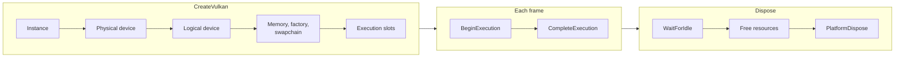
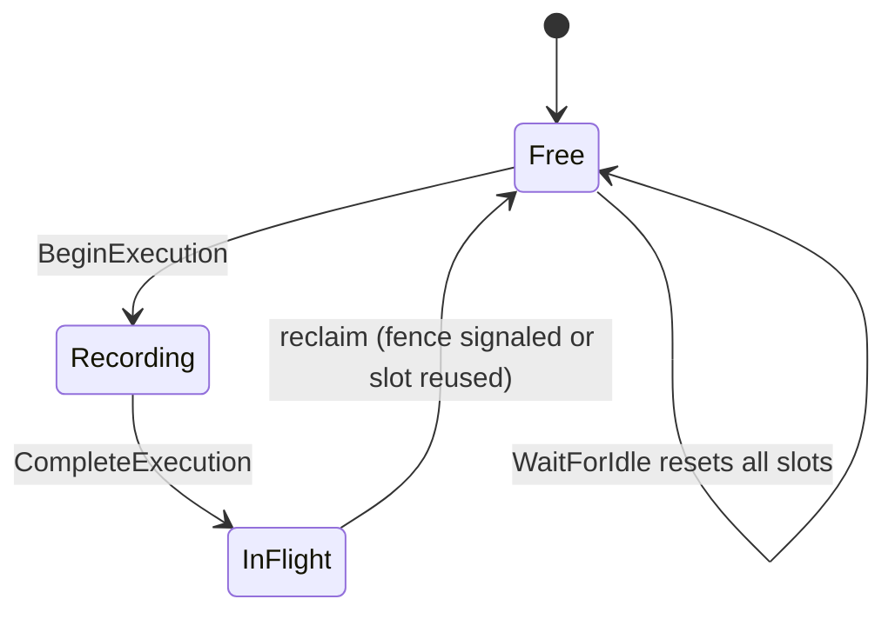

# Device and Execution

How `GraphicsDevice` is created and torn down, how the execution ring keeps several frames in flight, how fences and transient memory are recycled, and how the swapchain fits in.

- [Key types](#key-types)
- [Device lifecycle](#device-lifecycle)
- [The execution ring](#the-execution-ring)
- [Fences](#fences)
- [Transient memory](#transient-memory)
- [Writing to in-flight buffers](#writing-to-in-flight-buffers)
- [Swapchain](#swapchain)
- [Design decisions](#design-decisions)
- [Gotchas](#gotchas)
- [See also](#see-also)

## Overview

A `GraphicsDevice` is the root object: it makes resources, runs work, and presents. Work is grouped into `ExecutionTask`s. Each task owns one slot of a fixed-size ring (default 3 slots), one completion fence and one bump allocator for per-frame uniform data. The device hands out a slot with `BeginExecution`, the caller records and submits command buffers against the task, and `CompleteExecution` sends everything to the GPU. The slot returns to the free list only after its fence signals, which is what bounds how far the CPU can run ahead.

## Key types

| Type | File | Role |
| --- | --- | --- |
| `GraphicsDevice` | [GraphicsDevice.cs](../../Graphite/Core/GraphicsDevice/GraphicsDevice.cs) | Abstract root: features, swapchain, mapping, fences, dispose |
| `GraphicsDevice.Execution` | [GraphicsDevice.Execution.cs](../../Graphite/Core/GraphicsDevice/GraphicsDevice.Execution.cs) | Ring management, `BeginExecution`, `WaitForIdle`, transfer submits |
| `ExecutionTask` | [ExecutionTask.cs](../../Graphite/Core/GraphicsDevice/ExecutionTask.cs) | Handle to one in-flight execution |
| `Fence` | [Fence.cs](../../Graphite/Core/CommandBuffer/Fence.cs) | CPU-visible GPU signal |
| `GraphicsDeviceOptions` | [GraphicsDeviceOptions.cs](../../Graphite/Core/GraphicsDevice/GraphicsDeviceOptions.cs) | Ring size, transient sizes, swapchain defaults, validation, profiler |
| `TransientBufferPool` / `TransientTexturePool` | [TransientBufferPool.cs](../../Graphite/Core/GraphicsDevice/TransientBufferPool.cs) | Per-execution rented buffers and render textures |
| `GraphicsDevice.DeferredDisposal` | [GraphicsDevice.DeferredDisposal.cs](../../Graphite/Core/GraphicsDevice/GraphicsDevice.DeferredDisposal.cs) | Dispose-later lists keyed by idle or execution id |
| `Swapchain` / `SwapchainDescription` / `SwapchainSource` | [Swapchain/](../../Graphite/Core/Swapchain) | Presentable images and their platform surface |

Options that matter here (zero means "use default"):

| Option | Default | Effect |
| --- | --- | --- |
| `MaxFramesInFlight` | 3 | Ring size; `MaxExecutingTasks` |
| `TransientBufferInitialSize` | 4 MB | Primary transient uniform buffer per slot |
| `TransientBufferSoftCapBytes` | 64 MB | One-time warning when a slot's total grows past this |
| `TransientBufferHardCapBytes` | 256 MB | Exception (with validation on) past this |
| `EnableValidation` | on | See [08-validation-and-profiling.md](08-validation-and-profiling.md) |
| `Profiler` | null | Optional `IProfiler` |

The defaults and clamping (soft cap raised to at least the initial size, hard cap to at least the soft cap) are in [InitializeFrameOptions](../../Graphite/Core/GraphicsDevice/GraphicsDevice.Execution.cs#L210).

## Device lifecycle

1. **Create.** [CreateVulkan](../../Graphite/Core/GraphicsDevice/GraphicsDevice.Factory.cs#L33) constructs [VkGraphicsDevice](../../Graphite/Platform/Vulkan/VkGraphicsDevice/VkGraphicsDevice.cs#L29). `GraphicsDevice.IsBackendSupported(GraphicsBackend.Vulkan)` can be asked first; it creates a throwaway instance and checks for a platform surface extension ([CheckIsSupported](../../Graphite/Platform/Vulkan/VkGraphicsDevice/VkGraphicsDevice.cs#L193)). The swapchain description is optional; passing `null` gives a headless device with no `MainSwapchain`.
2. **Frame options.** The backend constructor calls `InitializeFrameOptions`, which builds the free-slot queue `0..N-1`, resolves transient sizes, and sets the static validation flag and the profiler. It must run before slots are created.
3. **Slots.** [InitializeSlots](../../Graphite/Platform/Vulkan/VkGraphicsDevice/VkGraphicsDevice.Execution.cs#L26) creates, per slot, a fence, a persistently mapped primary transient uniform buffer and a `VkUniformArena` over it.
4. **Default resources.** [PostDeviceCreated](../../Graphite/Core/GraphicsDevice/GraphicsDevice.DefaultResources.cs#L54) makes `PointSampler`, `LinearSampler`, `NullTexture2D`, `NullTextureRW2D`, `NullUniform`, and (when the features exist) `Aniso4xSampler`, `NullStructured`, `NullStructuredRW`. The binder substitutes these for unset properties.
5. **Dispose.** [Dispose](../../Graphite/Core/GraphicsDevice/GraphicsDevice.cs#L276) is idempotent: `WaitForIdle`, dispose the transient pools, dispose default resources, then `PlatformDispose` (slots, fences, swapchain, pools, memory manager, `vkDestroyDevice`). Resources created by the application must be disposed before the device.

## The execution ring

The ring bookkeeping is entirely in Core; the backend only supplies the `*Core` hooks.

**[BeginExecution](../../Graphite/Core/GraphicsDevice/GraphicsDevice.Execution.cs#L81)** takes `_executionLock`, reclaims finished tasks, and if no slot is free waits on the oldest active task. Then it dequeues a slot, increments the monotonic id (first id is 1; 0 means "nothing") and calls `BeginExecutionCore`. The Vulkan override ([VkGraphicsDevice.Execution.cs](../../Graphite/Platform/Vulkan/VkGraphicsDevice/VkGraphicsDevice.Execution.cs#L49)):

1. `CheckSubmittedFences` to retire anything still riding this slot's fence.
2. Resets the slot fence (`vkResetFences` plus the wrapper).
3. Returns the slot's overflow transient buffers to a device-wide free pool and rewinds the arena head to 0.
4. Returns the slot's rented graph command buffers to the pool (they are known complete).
5. Sweeps descriptor-set caches using `_maxExecutingTasks` as the retention window.
6. Builds a [VkExecutionTask](../../Graphite/Platform/Vulkan/VkExecutionTask.cs) that references the slot's fence, arena and command buffer lists.

**Recording.** Command buffers reach the task via `RenderContext.SubmitCommandBuffer`, which ends the buffer and calls [SubmitCommandsInternal](../../Graphite/Core/GraphicsDevice/ExecutionTask.cs#L24), appending it to a queue. Nothing is submitted yet. A `FlushSubmissions` happens only when something must be ordered after queued work, for example `SubmitTransferCommandBuffer` in the render context. It submits the queue with a pooled fence rather than the slot fence ([VkExecutionTask.FlushSubmissions](../../Graphite/Platform/Vulkan/VkExecutionTask.cs#L61)).

**[CompleteExecution](../../Graphite/Core/GraphicsDevice/GraphicsDevice.Execution.cs#L108)** calls `CompleteExecutionCore`, which calls `FinalSubmit(slotFence)`: one `vkQueueSubmit` of all remaining queued buffers that signals the slot fence. It does not block, and the task is still in `_activeTasks` until reclaimed.

**Reclaim.** [ReclaimCompletedExecutions_NoLock](../../Graphite/Core/GraphicsDevice/GraphicsDevice.Execution.cs#L232) is called from `BeginExecution`, `ExecutingTasks`, and `ActiveExecutions`. For each active task whose `IsExecutionCompleteCore` is true it removes the task, returns the slot to the free queue, advances `LastCompletedExecutionId`, and flushes execution-retired disposables. There is no background thread; reclaim is lazy and driven by the calls above.

**Completion checks.** The Vulkan [IsExecutionCompleteCore](../../Graphite/Platform/Vulkan/VkGraphicsDevice/VkGraphicsDevice.Execution.cs#L96) treats a task as complete if its slot has already moved on to a newer execution id, otherwise polls `vkGetFenceStatus`. [WaitForExecutionCore](../../Graphite/Platform/Vulkan/VkGraphicsDevice/VkGraphicsDevice.Execution.cs#L108) follows the same rule and calls `vkWaitForFences`.

| Member | Blocking | Notes |
| --- | --- | --- |
| `BeginExecution()` | Only if all slots busy | Waits on the oldest active task |
| `CompleteExecution(task)` | No | Submits and signals the slot fence |
| `IsExecutionComplete(task)` | No | Bumps `LastCompletedExecutionId` when true |
| `WaitForExecution(task, timeout)` | Yes | Returns false on timeout |
| `WaitForIdle()` | Yes | `vkQueueWaitIdle`, resets all slots, flushes all deferred disposals |
| `SubmitAndWait(TransferCommandBuffer)` | Yes | Independent of the ring |
| `ExecutingTasks`, `ActiveExecutions` | No | Reclaim as a side effect |

`DispatchGraph` is the usual driver: it calls `BeginExecution`, runs every view, then `CompleteExecution`, then `SwapBuffers` if needed ([source](../../Graphite/Core/RenderGraph/GraphicsDevice.DispatchRenderGraph.cs#L14)). You can also call the three methods yourself.

## Fences

`Fence` is a `GraphicsResource` with `Signaled` and `Reset()`. `ResourceFactory.CreateFence(bool signaled)` makes one, `GraphicsDevice.WaitForFence(fence, timeoutNs)` blocks on it. `ExecutionTask.CompletionFence` is one of these, but it is the **slot's** fence: the same `VkFence` object is reset the next time that slot is handed out. Waiting on it is valid only while the task is the newest occupant of its slot; `IsExecutionComplete(task)` and `WaitForExecution(task)` handle reuse.

The Vulkan device keeps a second, separate mechanism for mid-frame submissions and transfers: a queue of `FenceSubmissionInfo` records plus a pool of reusable `VkFence` handles ([Submission.cs](../../Graphite/Platform/Vulkan/VkGraphicsDevice/VkGraphicsDevice.Submission.cs)). [CheckSubmittedFences](../../Graphite/Platform/Vulkan/VkGraphicsDevice/VkGraphicsDevice.Submission.cs#L209) walks the list in order, stops at the first unsignaled fence (submissions on one queue complete in order), and runs [CompleteFenceSubmission](../../Graphite/Platform/Vulkan/VkGraphicsDevice/VkGraphicsDevice.Submission.cs#L230) for each finished one: command buffer completion callback, timing and pipeline-statistics readback for the profiler, return of pooled fences, and recycling of staging resources. See [07-vulkan-backend.md](07-vulkan-backend.md#submission-and-fences).

## Transient memory

Three different "transient" mechanisms exist. They all reuse memory once the owning execution is complete.

| Mechanism | API | Backing | Reuse trigger |
| --- | --- | --- | --- |
| Transient uniform ranges | `RenderContext.AllocateTransient(size)` -> `ExecutionTask.AllocateTransientInternal` | Per-slot `VkUniformArena` (mapped, bump allocated, grows via overflow buffers) | Slot's next `BeginExecutionCore` rewinds the head |
| Transient buffers | `GraphicsDevice.RentTransientBuffer(task, desc)` | [TransientBufferPool](../../Graphite/Core/GraphicsDevice/TransientBufferPool.cs#L23) keyed by `BufferDescription` | Pool `Rent` checks `IsExecutionIdComplete` on previously rented entries |
| Transient textures | `RentTransientTexture/Framebuffer/RenderTexture(task, desc)` | [TransientTexturePool](../../Graphite/Core/GraphicsDevice/TransientTexturePool.cs) keyed by `RenderTextureDescription` | Same as buffers |

Uniform ranges are valid only as uniform buffers for the life of the execution. Allocation aligns to `UniformBufferMinOffsetAlignment`, and when the active buffer is full the arena grows by adding an overflow buffer of `max(request, 2 * primary)` ([VkUniformArena.Allocate](../../Graphite/Platform/Vulkan/VkUniformArena.cs#L90)). Each growth checks the soft cap (one warning through `OnWarning`) and the hard cap (throws a `RenderException` while validation is on).

Rented pool entries are marked with the renting task's id; entries are returned to the free list lazily on the next `Rent`. Buffers from the pool are created with `TransientWrites = true`, which disables in-flight tracking for them.

Deferred disposal uses the same id scheme: [DisposeWhenIdle](../../Graphite/Core/GraphicsDevice/GraphicsDevice.DeferredDisposal.cs#L16) runs at the next `WaitForIdle`, and the internal `DisposeWhenFrameComplete(executionId, disposable)` runs when that execution is reclaimed (immediately for id 0).

## Writing to in-flight buffers

CPU writes to a `DeviceBuffer` (`UpdateBuffer`, or `Map` with `Write`/`ReadWrite`) call `EnsureWritable` ([source](../../Graphite/Core/DeviceBuffer/DeviceBuffer.cs#L63)). If the GPU may still be using the buffer (`MarkInFlight` was called by a command buffer binding it, for a non-transient buffer, and that execution is not complete), the buffer is **orphaned**: the backend allocates a fresh native buffer behind the same `DeviceBuffer` object and retires the old one with `DisposeWhenFrameComplete`. For Vulkan that is [VkBuffer.OrphanCore](../../Graphite/Platform/Vulkan/VkBuffer.cs#L127). The CPU never stalls, but a buffer that is rewritten every frame gets reallocated every frame; a warning fires if two orphans happen fewer than 10 executions apart. Data rewritten every frame belongs in a transient allocation.

`ContentVersion` increments on each CPU write or copy; compute-shader writes do not bump it.

## Swapchain

`SwapchainDescription` needs a `SwapchainSource`; `SwapchainSource.CreateVulkan(IVkSurface)` wraps a windowing-library surface. The device builds a `VkSwapchain` and exposes it as `MainSwapchain` and `SwapchainFramebuffer`. Extra swapchains come from `ResourceFactory.CreateSwapchain`.

[SwapBuffersCore](../../Graphite/Platform/Vulkan/VkGraphicsDevice/VkGraphicsDevice.cs) presents the current image after the GPU signals a per-image present semaphore, then acquires the next image with an acquire semaphore. There is no CPU wait on a fence: the first graphics-queue submit of the next frame waits on the acquire semaphore on the GPU. `vkAcquireNextImageKHR` can still block the CPU when every image is queued for presentation, so frame-time measurements around `DispatchGraph` include that throttling. See [07-vulkan-backend.md](07-vulkan-backend.md#swapchain-and-present). `ResizeMainWindow` calls `MainSwapchain.Resize`, which recreates the Vulkan swapchain and its framebuffers after a `WaitForIdle`. Changing `SyncToVerticalBlank` is deferred and applied at the next acquire by recreating the swapchain.

## Design decisions

### Why an execution ring instead of BeginFrame/EndFrame?
The old pair implied one implicit current frame. `BeginExecution` returns an explicit handle, so there is no global "current" state and work for different executions can be built on different threads. The ring size is the single knob bounding latency and memory: slot N's transient buffer and fence cannot be touched until the GPU is done with it, so `BeginExecution` blocks exactly when the CPU is `MaxFramesInFlight` ahead.

### Why is reclaim lazy?
A watcher thread would need its own synchronisation with the `_executionLock` and with Vulkan's fence APIs. Polling fence status at the natural synchronisation points (`BeginExecution`, the counters) costs one cheap call per in-flight task and keeps the device single-lock.

### Why orphaning instead of a staging copy?
Orphaning keeps the `DeviceBuffer` identity (so property sets and cached bindings that reference it stay valid) while avoiding both a stall and a GPU-side copy. The cost moves to the allocator, which is why repeated orphaning is warned about.

## Gotchas

- `BeginExecution` can block. It blocks when every slot is in flight, meaning the GPU is behind or `MaxFramesInFlight` is smaller than the latency requires.
- `LastCompletedExecutionId` advances on reclaim and explicit checks, not on the fence signal itself. `IsExecutionComplete(task)` gives the exact answer.
- `CompletionFence` belongs to a ring slot and is reset when the slot is reused, so it is valid only while the task is the newest occupant of its slot.
- Transient uniform ranges are invalid after their execution completes; the arena rewinds and overwrites them.
- `TransientWrites = true` disables all write-hazard tracking. Writing such a buffer while the GPU reads it is undefined behavior.
- `WaitForIdle` resets all slots, including ones a caller is still recording into. Calling it between `BeginExecution` and `CompleteExecution` is invalid.
- `SwapBuffers` and `ResizeMainWindow` throw if the device was created without a main swapchain.
- Only the swapchain depth format is optional: a `null` `SwapchainDepthFormat` gives a framebuffer with no depth attachment.

## See also

- [01-architecture.md](01-architecture.md), [07-vulkan-backend.md](07-vulkan-backend.md), [03-render-graph.md](03-render-graph.md)
- API: [graphics-device](../api/graphics-device.md), [buffers-and-textures](../api/buffers-and-textures.md)
