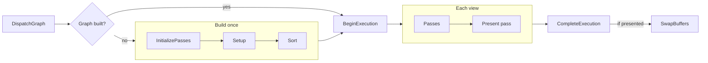
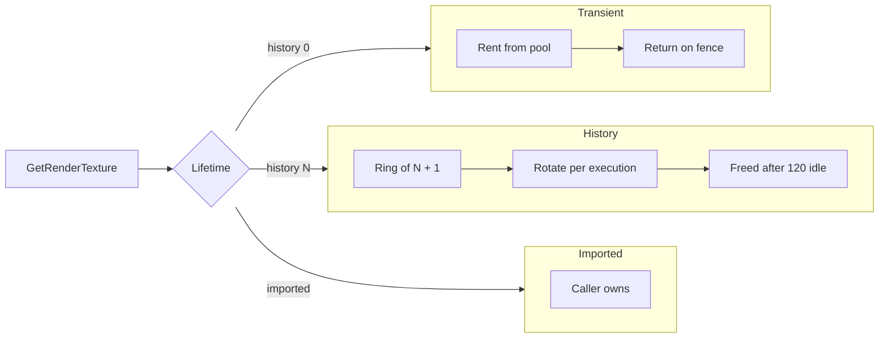

# Render Graph Internals

How Graphite turns a list of passes and their declared reads/writes into an ordered, per-view execution, and how graph resources live and die.

- [Overview](#overview)
- [Key types](#key-types)
- [Control flow](#control-flow)
- [Resource lifetimes](#resource-lifetimes)
- [Design decisions](#design-decisions)
- [Gotchas and pitfalls](#gotchas-and-pitfalls)
- [See also](#see-also)

## Overview

A `RenderPipeline<TView>` owns a list of `IPass<TView>` plus exactly one `IPresentPass<TView>`. The first time anything asks for `pipeline.Graph`, the pipeline runs `InitializePasses`, then `RenderGraph<TView>.Build` calls every pass's `Setup`, collects the resource IDs each pass reads and writes, links writers to readers, and topologically sorts the passes. The solved graph is cached. `GraphicsDevice.DispatchGraph` then runs the same solved graph once per view inside a single `ExecutionTask`.

Important scoping fact: the "graph" is a pass-ordering and resource-naming structure. It does not insert barriers, alias memory, or cull passes. Physical textures and buffers are obtained lazily, when a pass calls `GetRenderTexture` or `GetRenderBuffer` during `Render`.

## Key types

| Type | Role | Source |
|------|------|--------|
| `RenderPipeline<TView>` | Owns passes, central resources, lazily builds and caches the graph, runs `ExecuteView` | [RenderPipeline.cs](../../Graphite/Core/RenderGraph/RenderPipeline.cs#L10) |
| `RenderGraph<TView>` | Solved result: `OrderedPasses`, merged `Resources`, present inputs | [RenderGraph.cs](../../Graphite/Core/RenderGraph/RenderGraph.cs#L7) |
| `RenderGraph<TView>.PassNode` | A pass plus its declared input and output IDs | [RenderGraph.cs](../../Graphite/Core/RenderGraph/RenderGraph.cs#L11) |
| `RenderContextBuilder` / `PresentContextBuilder` | What a pass sees in `Setup`; records reads and writes | [RenderContextBuilder.cs](../../Graphite/Core/RenderGraph/RenderContextBuilder.cs), [PresentContextBuilder.cs](../../Graphite/Core/RenderGraph/PresentContextBuilder.cs) |
| `RenderContext<TView>` | Per-view object passes use in `Render`; resolves handles, rents command buffers | [RenderContext.cs](../../Graphite/Core/RenderGraph/RenderContext.cs#L9) |
| `GraphTextureResource` / `GraphBufferResource` | Declared resource plus history depth and its ring storage | [GraphResource.cs](../../Graphite/Core/RenderGraph/GraphResource.cs#L126) |
| `GraphImportedTextureResource` | Externally owned texture registered under an ID | [GraphResource.cs](../../Graphite/Core/RenderGraph/GraphResource.cs#L232) |
| `HistoryRings<TResource, TDesc>` | Internal per-view ring allocator for history resources | [GraphResource.cs](../../Graphite/Core/RenderGraph/GraphResource.cs#L20) |
| `TextureHandle` / `BufferHandle` | Opaque wrappers over `RenderResourceID` | [Handles.cs](../../Graphite/Core/RenderGraph/Handles.cs) |
| `TargetLoadStoreOps` | Per-resource load/store defaults | [AttachmentOps.cs](../../Graphite/Core/RenderGraph/AttachmentOps.cs#L53) |

## Control flow

### 1. Dispatch

[DispatchGraph](../../Graphite/Core/RenderGraph/GraphicsDevice.DispatchRenderGraph.cs#L14) does four things: reads `pipeline.Graph`, calls `BeginExecution`, loops the views, and calls `CompleteExecution`. For each view it builds a fresh `RenderContext`, brackets the work in `Profiler?.BeginView/EndView`, and ORs `context.RequestPresent` into a flag. `SwapBuffers` is called once, after `CompleteExecution`, and only if at least one view armed present.

All views in one dispatch share one `ExecutionTask`: one ring slot, one fence, one transient bump allocator. The execution lifecycle itself is covered in [02-device-and-execution.md](02-device-and-execution.md).

### 2. Build (graph compile)

[`RenderGraph.Build`](../../Graphite/Core/RenderGraph/RenderGraph.cs#L67) runs once per pipeline initialization, not per frame:

1. Centrally declared resources (`DeclareTexture`, `DeclareBuffer`) are added to the `Resources` dictionary first, with `TryAdd`.
2. For each pass in `AddPass` order: reset the shared `RenderContextBuilder`, call `Setup`, copy out the declared inputs (IDs only) and outputs (full `GraphResource` objects). Each output is `TryAdd`ed to `Resources`, so the first declaration of an ID defines its description; later declarations only count as additional writers.
3. The present pass `Setup` records its inputs and whether it needs the swapchain. It has no outputs.
4. [`ValidateInputsHaveProducers`](../../Graphite/Core/RenderGraph/RenderGraph.cs#L122): every pass input and present input must exist in `Resources`, otherwise `InvalidOperationException` naming the pass and resource.
5. [`TopologicalSort`](../../Graphite/Core/RenderGraph/RenderGraph.cs#L148) produces the final order.

### 3. Ordering from declared reads and writes

The sort is Kahn's algorithm with a linear scan for the next ready node. The scan always takes the lowest original index among ready passes, so ties resolve to `AddPass` order and the result is deterministic. Properties of the sort:

- Edges only exist from a writer to a reader of the same ID. Two passes that write the same ID with no reader between them get no ordering edge between each other; they stay in insertion order only as a consequence of the tie-break.
- A pass that both reads and writes an ID skips the self edge. This is what lets a pass read its own previous-frame output as history.
- An input with no writer pass but a central declaration is valid and creates no edge.
- A cycle throws during `Build`, before any rendering.
- The present pass is not part of the sort. It always runs last, and its inputs are recorded only for validation and profiling.

### 4. ExecuteView

[`ExecuteView`](../../Graphite/Core/RenderGraph/RenderPipeline.cs#L97) iterates `OrderedPasses`. For each pass it:

1. Builds a `PassInfo` and opens a profiler pass scope.
2. If a profiler is attached, resolves each declared input and reports it as a pass read.
3. Calls `context.SetCurrentPass(passInfo, node.DeclaredOutputs)`. The declared outputs matter: `GetTargetOps` consults them first, so the running pass's own load/store ops win.
4. Calls `pass.Render(context)`, then clears the current pass.
5. Closes the profiler scope and reports outputs.
6. Calls [`ReclaimUnsubmittedCommandBuffers`](../../Graphite/Core/RenderGraph/RenderContext.cs#L108): any command buffer rented but never submitted raises `OnWarning` and is dropped.
7. If the profiler asks for capture, copies each texture output through a `TransferCommandBuffer`.

After the loop it calls `PresentPass.Present(context)` and reclaims again. `_executingView` is set for the duration so `InvalidateGraph` can be rejected mid-dispatch.

## Resource lifetimes

Three lifetimes exist, decided by how a resource is declared.

| Kind | Declared by | Backing storage | Freed when | Default ops |
|------|-------------|-----------------|------------|-------------|
| Transient | `GetOutputTexture(id, desc)` with `history = 0`, or `DeclareTexture` / `DeclareBuffer` | Rented from the device's transient pool on first `GetRender*` in a view | Returned to the pool once the execution's fence signals | Clear + Store |
| History | `GetOutputTexture(id, desc, history: N)` | `N+1`-slot ring per view, owned by the graph | Ring disposed after 120 unused executions, on resize, or when the graph is disposed | Load + Store |
| Imported | `ImportTexture(id, rt)` | Caller's `RenderTexture` | Never by the graph | Load + Store |

"Shared" in the sense of this page means a resource declared once centrally on the pipeline and referenced by ID from several passes. It is still transient or history by lifetime; the central declaration only decides who owns the description.

### Transient resources

[`GetRenderTexture`](../../Graphite/Core/RenderGraph/RenderContext.cs#L164) for a depth-0 texture calls `RentTransientRenderTexture(task, desc)` and memoizes the result in a per-context dictionary. Consequences:

- Every pass in the same view that resolves the same ID gets the same physical target.
- A different view in the same dispatch gets a different one, because the first is still in flight.
- The description is resolved against the view: `ViewSized` with `Scale` multiplies view pixel size (minimum 1), `Sized` is fixed.
- Contents are undefined on rent, which is why transient targets default to `Clear`.
- Nothing is rented for a resource nobody resolves. A resource that is declared but never touched in `Render` costs nothing.

Buffers follow the same rule via `RentTransientBuffer`.

### History resources

History depth `N` allocates `N+1` copies per view ([HistoryRings.Resolve](../../Graphite/Core/RenderGraph/GraphResource.cs#L46)). Behaviors:

- The ring is keyed by `view.ViewId`. Two views with different IDs never share history.
- The ring advances once per execution id (`_task.Id`), not once per call and not per view. Multiple resolves inside one execution return the same slot for `framesAgo = 0`.
- The slot returned is `(CurrentIndex - framesAgo) mod slots`. `framesAgo` outside `[0, HistoryDepth]` throws.
- If the stored description differs from the requested one (for example the view was resized), the whole ring is disposed and reallocated. `IsHistoryValid` returns false in that execution, because it requires the ring to have been allocated in an earlier execution.
- Retention: `Advance` counts executions; a ring unused for more than `RetentionExecutions = 120` executions is disposed.
- Texture slots are named `Name[v{viewId}][{slot}]`. Buffer slots are marked `SetTransientWrites(true)`.

### Imported resources

An imported resource resolves to the caller's `RenderTexture` directly. Requesting `framesAgo != 0` throws. The graph never disposes it.

## Design decisions

### Why declare reads and writes instead of calling passes in order?

Passes are written by different people (a scene pass, a bloom pass, a post chain). With declared IDs, adding or removing a pass re-solves the order automatically, and a missing producer becomes a build-time error with both names in the message instead of a black texture at runtime.

### Why handles instead of textures in Setup?

Setup runs before any view exists, so sizes are unknown. A handle is just an ID; the real texture is resolved in `Render` against the current view and execution. That also means one compiled graph serves every view and every frame.

### Why first declaration wins?

Inputs carry only an ID, so the description has to come from exactly one place. Central declarations are inserted first and therefore take priority over any pass's output declaration of the same ID. The cost is that two passes declaring the same ID with different descriptions silently use the first one.

### Why per-resource ops and per-pass override?

`GraphTextureResource.Ops` defaults from lifetime ([ForLifetime](../../Graphite/Core/RenderGraph/AttachmentOps.cs#L69)): transient clears, persistent loads, because a pooled texture has garbage contents while a history texture has last frame's. `GetTargetOps` first searches the currently running pass's own declared outputs, so a second pass that writes the same ID with `Loaded` ops gets `Loaded` even though the first declaration said `Cleared`.

### Why lazy graph build?

`Graph` runs `InitializePasses` on first access, so subclass constructors and field initializers have completed and passes can be fully constructed before being added.

### Why no barriers in the graph?

Image layout transitions for sampled textures happen at draw time in the backend, when the descriptor binder resolves each bound texture (see [04-resource-binding.md](04-resource-binding.md)). The graph's job stops at ordering and naming.

## Gotchas and pitfalls

- History rotates per execution. Calling `DispatchGraph` twice in a frame rotates twice.
- A view that is not dispatched for 120 executions loses its history rings. The next dispatch starts with empty history, and `context.IsHistoryValid(handle)` returns false.
- A history resource is declared as an output with `history`. Ordering after earlier writers comes only from declaring it as an input as well, because self edges are ignored.
- Changing a view's `ViewId` reallocates its ring.
- Default `TextureHandle`/`BufferHandle` have `IsValid == false`; resolving one throws `ArgumentException`.
- Resolving a texture ID with `GetRenderBuffer` (or vice versa) throws with a message naming the right method.
- Command buffers are submitted through `context.SubmitCommandBuffer`. A rented-but-unsubmitted buffer produces a warning and is discarded.
- `InvalidateGraph` disposes history rings and reruns `InitializePasses` on next access; it throws if called while a view executes.
- `IPresentPass.Setup` cannot declare outputs, so nothing can consume the present pass's work through the graph.
- Present is skipped entirely (no `SwapBuffers`) unless some view's present pass called `context.Present()`. `SwapchainTarget` is null unless the present pass called `RequestSwapchain()`.

## See also

- [api/render-graph.md](../api/render-graph.md) - user-facing API and a full two-pass example
- [api/command-buffers.md](../api/command-buffers.md) - what passes record
- [02-device-and-execution.md](02-device-and-execution.md) - `ExecutionTask`, fences, transient memory
- [04-resource-binding.md](04-resource-binding.md) - how textures resolved here get bound at draw time
- [08-validation-and-profiling.md](08-validation-and-profiling.md) - profiler hooks in `ExecuteView`
