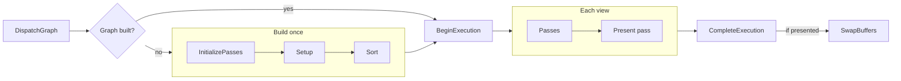
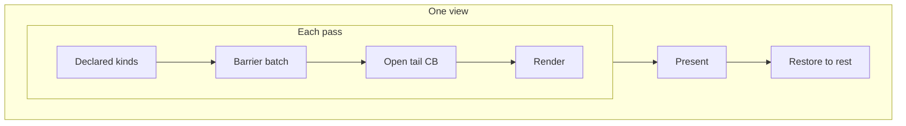
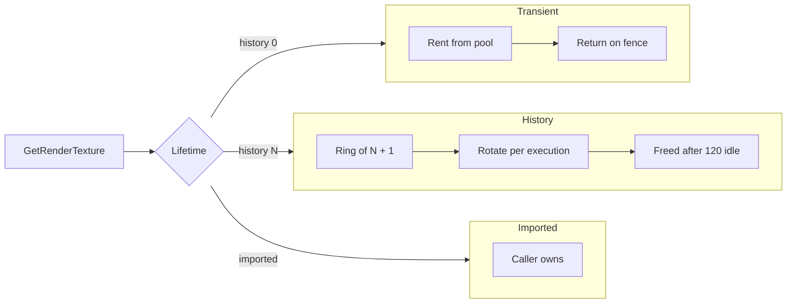

# Render Graph Internals

How Graphite turns a list of passes and their declared reads/writes into an ordered, per-view execution, how it moves graph resources between states with barriers, and how graph resources live and die.

- [Overview](#overview)
- [Key types](#key-types)
- [Control flow](#control-flow)
- [Resource states and barriers](#resource-states-and-barriers)
- [Resource lifetimes](#resource-lifetimes)
- [Design decisions](#design-decisions)
- [See also](#see-also)

## Overview

A `RenderPipeline<TView>` owns a list of `IPass<TView>` plus exactly one `IPresentPass<TView>`. The first time anything asks for `pipeline.Graph`, the pipeline runs `InitializePasses`, then `RenderGraph<TView>.Build` calls every pass's `Setup`, collects the resource IDs each pass reads and writes, links writers to readers, and topologically sorts the passes. The solved graph is cached. `GraphicsDevice.DispatchGraph` then runs the same solved graph once per view inside a single `ExecutionTask`.

The graph orders passes, names resources, and owns the state of every graph resource inside an execution: each declaration carries a usage kind, and the graph records the barriers that move resources into those states before each pass runs. It does not alias memory or cull passes. Physical textures and buffers are obtained when a pass starts (for its declared resources) or when a pass calls `GetRenderTexture` or `GetRenderBuffer` during `Render`.

## Key types

| Type | Role | Source |
|------|------|--------|
| `RenderPipeline<TView>` | Owns passes, central resources, lazily builds and caches the graph, runs `ExecuteView` | [RenderPipeline.cs](../../Graphite/Core/RenderGraph/RenderPipeline.cs#L10) |
| `RenderGraph<TView>` | Solved result: `OrderedPasses`, merged `Resources`, present inputs | [RenderGraph.cs](../../Graphite/Core/RenderGraph/RenderGraph.cs#L7) |
| `RenderGraph<TView>.PassNode` | A pass plus its declared input and output IDs and its `ResourceAccess` list | [RenderGraph.cs](../../Graphite/Core/RenderGraph/RenderGraph.cs#L11) |
| `RenderContextBuilder` / `PresentContextBuilder` | What a pass sees in `Setup`; records reads and writes with their usage kinds | [RenderContextBuilder.cs](../../Graphite/Core/RenderGraph/RenderContextBuilder.cs), [PresentContextBuilder.cs](../../Graphite/Core/RenderGraph/PresentContextBuilder.cs) |
| `TextureUsageKind` / `BufferUsageKind` | Public usage kinds a declaration carries | [UsageKinds.cs](../../Graphite/Core/RenderGraph/UsageKinds.cs#L6) |
| `ResourceAccess` | Internal record of one declaration: ID, texture or buffer, input or output, declared kinds, start kind, optional depth kind | [UsageKinds.cs](../../Graphite/Core/RenderGraph/UsageKinds.cs#L60) |
| `TextureState` / `BufferAccess` / `TextureBarrier` | Platform-agnostic barrier vocabulary the graph hands to the backend | [ResourceBarriers.cs](../../Graphite/Core/CommandBuffer/ResourceBarriers.cs) |
| `RenderContext<TView>` | Per-view object passes use in `Render`; resolves handles, rents command buffers, tracks resource states | [RenderContext.cs](../../Graphite/Core/RenderGraph/RenderContext.cs#L9) |
| `GraphTextureResource` / `GraphBufferResource` | Declared resource plus history depth and its ring storage | [GraphResource.cs](../../Graphite/Core/RenderGraph/GraphResource.cs#L126) |
| `GraphImportedTextureResource` | Externally owned texture registered under an ID | [GraphResource.cs](../../Graphite/Core/RenderGraph/GraphResource.cs#L234) |
| `HistoryRings<TResource, TDesc>` | Internal per-view ring allocator for history resources | [GraphResource.cs](../../Graphite/Core/RenderGraph/GraphResource.cs#L20) |
| `TextureHandle` / `BufferHandle` | Opaque wrappers over `RenderResourceID` | [Handles.cs](../../Graphite/Core/RenderGraph/Handles.cs) |
| `TargetLoadStoreOps` | Per-resource load/store defaults | [AttachmentOps.cs](../../Graphite/Core/RenderGraph/AttachmentOps.cs#L53) |

## Control flow

### 1. Dispatch

[DispatchGraph](../../Graphite/Core/RenderGraph/GraphicsDevice.DispatchRenderGraph.cs#L14) does four things: reads `pipeline.Graph`, calls `BeginExecution`, loops the views, and calls `CompleteExecution`. For each view it builds a fresh `RenderContext`, brackets the work in `Profiler?.BeginView/EndView`, and ORs `context.RequestPresent` into a flag. `SwapBuffers` is called once, after `CompleteExecution`, and only if at least one view armed present.

All views in one dispatch share one `ExecutionTask`: one ring slot, one fence, one transient bump allocator. The execution lifecycle itself is covered in [02-device-and-execution.md](02-device-and-execution.md).

### 2. Build (graph compile)

[`RenderGraph.Build`](../../Graphite/Core/RenderGraph/RenderGraph.cs#L74) runs once per pipeline initialization, not per frame:

1. Centrally declared resources (`DeclareTexture`, `DeclareBuffer`) are added to the `Resources` dictionary first, with `TryAdd`.
2. For each pass in `AddPass` order: reset the shared `RenderContextBuilder`, call `Setup`, copy out the declared inputs (IDs only), outputs (full `GraphResource` objects) and accesses (ID plus usage kind). Each output is `TryAdd`ed to `Resources`, so the first declaration of an ID defines its description; later declarations only count as additional writers.
3. The present pass `Setup` records its inputs, their usage kinds, and whether it needs the swapchain. It has no outputs.
4. [`ValidateInputsHaveProducers`](../../Graphite/Core/RenderGraph/RenderGraph.cs#L177): every pass input and present input must exist in `Resources`, otherwise `InvalidOperationException` naming the pass and resource.
5. [`ApplyStorageUsage`](../../Graphite/Core/RenderGraph/RenderGraph.cs#L132): a texture declaration against a buffer ID (or the reverse) throws. A texture declared `Storage` by any pass gets `TextureUsage.Storage` on its color textures; an imported texture declared `Storage` must already have it.
6. [`TopologicalSort`](../../Graphite/Core/RenderGraph/RenderGraph.cs#L203) produces the final order.

### 3. Ordering from declared reads and writes

The sort is Kahn's algorithm with a linear scan for the next ready node. The scan always takes the lowest original index among ready passes, so ties resolve to `AddPass` order and the result is deterministic. Properties of the sort:

- Edges only exist from a writer to a reader of the same ID. Two passes that write the same ID with no reader between them get no ordering edge between each other; they stay in insertion order only as a consequence of the tie-break.
- A pass that both reads and writes an ID skips the self edge. This is what lets a pass read its own previous-frame output as history.
- An input with no writer pass but a central declaration is valid and creates no edge.
- A cycle throws during `Build`, before any rendering.
- The present pass is not part of the sort. It always runs last, and its inputs are recorded only for validation and profiling.

### 4. ExecuteView

[`ExecuteView`](../../Graphite/Core/RenderGraph/RenderPipeline.cs#L97) iterates `OrderedPasses`. For each pass it:

1. Builds a `PassInfo` and opens a profiler pass scope.
2. If a profiler is attached, resolves each declared input and reports it as a pass read.
3. Calls `context.SetCurrentPass(passInfo, node.DeclaredOutputs, node.Accesses, name)`. The declared outputs matter: `GetTargetOps` consults them first, so the running pass's own load/store ops win. The accesses are what `GetRenderTexture` and `GetRenderBuffer` check declarations against.
4. Calls [`context.TransitionForAccesses`](../../Graphite/Core/RenderGraph/RenderContext.cs#L67), which records and submits the pass's barriers (see [Resource states and barriers](#resource-states-and-barriers)).
5. Calls `pass.Render(context)`, then clears the current pass.
6. Closes the profiler scope and reports outputs.
7. Calls [`ReclaimUnsubmittedCommandBuffers`](../../Graphite/Core/RenderGraph/RenderContext.cs#L305): any command buffer rented but never submitted raises `OnWarning` and is dropped.
8. If the profiler asks for capture, copies each texture output through a `TransferCommandBuffer`. The copy reads the output's current state from the context and transitions out of and back into it.

After the loop it sets the present pass's accesses as current, records its barriers, calls `PresentPass.Present(context)`, reclaims again, and finally calls [`RestoreRestingStates`](../../Graphite/Core/RenderGraph/RenderContext.cs#L97). `_executingView` is set for the duration so `InvalidateGraph` can be rejected mid-dispatch.

## Resource states and barriers

Every texture has a **resting layout** computed from its `TextureUsage`: `ShaderReadOnly` if `Sampled`, else `General` if `Storage`, else the color or depth attachment layout (`PresentSrc` for swapchain images). Outside a graph execution every texture sits in its resting layout, and nothing stores that fact: it is recomputed from the usage whenever it is needed.

Inside an execution the `RenderContext` owns the state of graph textures in a `Texture -> TextureState` dictionary. A texture missing from the dictionary is `Resting`. `TextureState` is abstract (`Resting`, `Sampled`, `Storage`, `Attachment`, `TransferSrc`, `TransferDst`, `DepthReadOnly`); the backend maps it to a layout, stage mask and access mask.

`TransitionForAccesses` walks the pass's accesses:

- **Textures.** Each declared resource is resolved (renting it if needed). Every color texture moves to the declaration's start kind (`initial`, or the only declared kind). The depth texture moves to `depthUsage` when given, else follows the color kind, except that `Storage` leaves it alone. A barrier is added when the state changes, or when the target state writes (`Storage`, `Attachment`, `TransferDst`) so back-to-back writers are ordered. When a pass declares the same ID as input and output, the output declaration wins.
- **Buffers.** Buffers have no layout, so one global memory barrier covers them. Each graph buffer tracks its last write access, the reads since that write, and the reads the last barrier already made visible. A write adds the last write and the reads since it to the source scope; a read adds the last write only if the read kind is not visible yet. A buffer seen for the first time in a view assumes a prior shader or transfer write and prior reads of every kind.

If anything is needed, the batch is recorded through the internal `CommandBuffer.RecordBarriers` into the execution's open tail, and the state dictionary is updated after it.

The open tail is the command buffer most recently submitted through `SubmitCommandBuffer`. Submitting a buffer closes any open render pass on it (applying queued clears) but defers `End`: the buffer stays open as the execution's tail, so the next pass's barriers are appended to it and run after everything already queued and before anything the next pass submits. Submitting another buffer, a transfer flush (`SubmitTransferCommandBuffer`) and `CompleteExecution` end the tail and queue it. The tail carries over between views of one dispatch.

When there is no tail (the first pass of an execution, or the first pass after a transfer flush), the batch is deferred and recorded at the start of the first command buffer the pass rents. That buffer must then be submitted before the pass's other buffers, otherwise [`SubmitCommandBuffer`](../../Graphite/Core/RenderGraph/RenderContext.cs#L288) throws `InvalidOperationException`; submitting a transfer before it throws as well. If the pass rents nothing, or never submits that buffer, the batch goes into a separate command buffer named `"<pass> Barriers"` after the pass.

### In-pass transitions

[`Transition`](../../Graphite/Core/RenderGraph/RenderContext.cs#L114) lets a pass move a texture between the kinds it declared. It checks the kind against the pass's declaration, builds the same kind of barrier batch for the current texture of that ID (depth follows only when `depthUsage` was not given), records it into the pass's own command buffer, then commits the new states. The next pass's barriers start from wherever the texture was left. The overload without a command buffer records into the pass's only open command buffer and throws when the pass holds none or several.

Since the state now follows recording order, a pass that has transitioned must submit in rent order: [`SubmitCommandBuffer`](../../Graphite/Core/RenderGraph/RenderContext.cs#L288) throws if the buffer being submitted is not the oldest one the pass still holds. The flag resets when the next pass starts.

`RestoreRestingStates` runs after the present pass and moves every non-resting texture back to `Resting` with one final batch, appended to the open tail (or a `"<present> Barriers"` command buffer when there is none). Because of this, pooled transient textures, history rings and imported textures need no stored layout between executions.

Every command buffer rented through the context (graphics and transfer) points at the same state dictionary, so backend commands that need a specific layout (copies, mip generation, resolves) start from the texture's current state and return to it. A texture that is not a graph resource is always `Resting` for them.

### Undeclared use

[`CheckDeclared`](../../Graphite/Core/RenderGraph/RenderContext.cs#L228) runs in `GetRenderTexture` and `GetRenderBuffer` while a pass or the present pass is current. Resolving an ID the pass did not declare throws `InvalidOperationException`. Outside a pass (profiler reads, capture) no check applies.

## Resource lifetimes

Three lifetimes exist, decided by how a resource is declared.

| Kind | Declared by | Backing storage | Freed when | Default ops |
|------|-------------|-----------------|------------|-------------|
| Transient | `DeclareOutputTexture(id, desc)` with `history = 0`, or `DeclareTexture` / `DeclareBuffer` | Rented from the device's transient pool on first `GetRender*` in a view | Returned to the pool once the execution's fence signals | Clear + Store |
| History | `DeclareOutputTexture(id, desc, history: N)` | `N+1`-slot ring per view, owned by the graph | Ring disposed after 120 unused executions, on resize, or when the graph is disposed | Load + Store |
| Imported | `DeclareImportedTexture(id, rt)` | Caller's `RenderTexture` | Never by the graph | Load + Store |

"Shared" in the sense of this page means a resource declared once centrally on the pipeline and referenced by ID from several passes. It is still transient or history by lifetime; the central declaration only decides who owns the description.

### Transient resources

[`GetRenderTexture`](../../Graphite/Core/RenderGraph/RenderContext.cs#L355) for a depth-0 texture calls `RentTransientRenderTexture(task, desc)` and memoizes the result in a per-context dictionary. Consequences:

- Every pass in the same view that resolves the same ID gets the same physical target.
- A different view in the same dispatch gets a different one, because the first is still in flight.
- The description is resolved against the view: `ViewSized` with `Scale` multiplies view pixel size (minimum 1), `Sized` is fixed.
- A rented texture is in its resting layout, but its contents are undefined, which is why transient targets default to `Clear`.
- Nothing is rented for a resource nobody resolves. A resource that is declared but never touched in `Render` costs nothing.

Buffers follow the same rule via `RentTransientBuffer`.

### History resources

History depth `N` allocates `N+1` copies per view ([HistoryRings.Resolve](../../Graphite/Core/RenderGraph/GraphResource.cs#L46)). Behaviors:

- The ring is keyed by `view.ViewId`. Two views with different IDs never share history.
- The ring advances once per execution id (`_task.Id`), not once per call and not per view. Multiple resolves inside one execution return the same slot for `framesAgo = 0`.
- The slot returned is `(CurrentIndex - framesAgo) mod slots`. `framesAgo` outside `[0, HistoryDepth]` throws.
- If the stored description differs from the requested one (for example the view was resized), the whole ring is disposed and reallocated. `IsHistoryValid` returns false in that execution, because it requires the ring to have been allocated in an earlier execution.
- Retention: `Advance` counts executions; a ring unused for more than `RetentionExecutions = 120` executions is disposed.
- Texture slots are named `Name[v{viewId}][{slot}]`. Buffer slots are marked `SetTransientWrites(true)`.

### Imported resources

An imported resource resolves to the caller's `RenderTexture` directly. Requesting `framesAgo != 0` throws. The graph never disposes it. It must be in its resting layout when the execution starts, and the graph returns it there when the view ends. `DeclareImportedTexture` takes a usage kind like any output, `Attachment` by default.

## Design decisions

### Why declare reads and writes instead of calling passes in order?

Passes are written by different people (a scene pass, a bloom pass, a post chain). With declared IDs, adding or removing a pass re-solves the order automatically, and a missing producer becomes a build-time error with both names in the message instead of a black texture at runtime.

### Why handles instead of textures in Setup?

Setup runs before any view exists, so sizes are unknown. A handle is just an ID; the real texture is resolved in `Render` against the current view and execution. That also means one compiled graph serves every view and every frame.

### Why first declaration wins?

Inputs carry only an ID, so the description has to come from exactly one place. Central declarations are inserted first and therefore take priority over any pass's output declaration of the same ID. The cost is that two passes declaring the same ID with different descriptions silently use the first one.

### Why per-resource ops and per-pass override?

`GraphTextureResource.Ops` defaults from lifetime ([ForLifetime](../../Graphite/Core/RenderGraph/AttachmentOps.cs#L69)): transient clears, persistent loads, because a pooled texture has garbage contents while a history texture has last frame's. `GetTargetOps` first searches the currently running pass's own declared outputs, so a second pass that writes the same ID with `Loaded` ops gets `Loaded` even though the first declaration said `Cleared`.

### Why lazy graph build?

`Graph` runs `InitializePasses` on first access, so subclass constructors and field initializers have completed and passes can be fully constructed before being added.

### Why does the graph own barriers?

The graph is the only place that knows how every resource is used by every pass, so it can move each resource once per pass boundary with exact access masks. The backend keeps no per-texture state: it maps an abstract state to a layout and never asks what layout an image is in. Anything outside the graph uses the stateless resting-layout rule.

### Why restore everything to rest at the end of a view?

It costs one barrier per touched resource per view and removes all cross-execution state. Pools and history rings hand out textures in a known layout without storing it, and imported textures follow the same contract as any other texture.

### Why an explicit start kind and rent-order submits for transitions?

A declaration with several kinds has no natural start state, and a hidden priority rule would surprise whoever reads the pass, so the declaration names it. Transitions recorded mid-pass are the one place state follows recording order instead of the plan; requiring rent-order submission only in passes that transition keeps that ordering true without restricting every other pass.

### Why whole-image states?

Graph textures are always one mip and one layer, so a whole-image state is exact. Per-mip or per-layer work (mip generation, resolves) happens inside a single command, which transitions its own subresources and returns them to the texture's current state.

### Why append barriers to the open tail?

A pass may rent several command buffers and submit them in any order, so the start of the pass's own first buffer is not a safe place for its barriers in general. The end of the last buffer already submitted is: it precedes, in queue order, everything the pass will submit. Appending there avoids a dedicated command buffer per pass (and its begin, end and profiler queries) without restricting the pass. Only when nothing has been submitted yet does the batch fall back to the pass's first rented buffer, and only then does submit order matter.

## See also

- [api/render-graph.md](../api/render-graph.md) - user-facing API and a full two-pass example
- [api/command-buffers.md](../api/command-buffers.md) - what passes record
- [02-device-and-execution.md](02-device-and-execution.md) - `ExecutionTask`, fences, transient memory
- [04-resource-binding.md](04-resource-binding.md) - how textures resolved here get bound at draw time
- [08-validation-and-profiling.md](08-validation-and-profiling.md) - profiler hooks in `ExecuteView`
