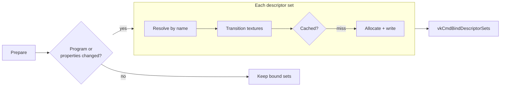

# Resource Binding Internals

How a `PropertySet` full of named values becomes Vulkan descriptor sets at draw time.

- [Overview](#overview)
- [Key types](#key-types)
- [Control flow](#control-flow)
- [Design decisions](#design-decisions)
- [Gotchas and pitfalls](#gotchas-and-pitfalls)
- [See also](#see-also)

## Overview

Graphite binds by name. The application fills a `PropertySet` with entries keyed by `PropertyID` (an interned string). `CommandBuffer.SetProperties` merges the set into the command buffer's active table. Nothing touches the GPU at that point. At the next draw or dispatch the backend walks the bound program's `ResourceLayoutDescription`s, looks each element up by name in the active table, builds a content identity, and either reuses a cached descriptor set or writes a new one.

The core layer only defines the data model and the merge. All descriptor work is backend code; this page describes the Vulkan backend.

## Key types

| Type | Role | Source |
|------|------|--------|
| `PropertyID` | Interned string as a cheap int; implicit conversion from `string` | [PropertyID.cs](../../Graphite/Core/Identifiers/PropertyID.cs#L10) |
| `PropertySet` | Dictionary of named entries with version counters | [PropertySet.cs](../../Graphite/Core/Binding/PropertySet.cs#L13) |
| `PropertyEntry` (internal) | One entry: uniform payload, buffer range, texture/view, or sampler, plus a version | [PropertyEntry.cs](../../Graphite/Core/Binding/PropertyEntry.cs) |
| `ResourceLayoutDescription` / `ResourceLayoutElementDescription` | A descriptor set and its elements (name, kind, stages, binding index, options, uniform fields) | [ResourceLayoutElementDescription.cs](../../Graphite/Core/Binding/ResourceLayoutElementDescription.cs) |
| `SetBindingMetadata` (internal) | Precomputed per-set data: UBOs sorted by binding, same-named-texture flags, uniform block slots and sizes | [SetBindingMetadata.cs](../../Graphite/Core/Shader/SetBindingMetadata.cs#L7) |
| `VkDescriptorBinder` | Per command buffer resolve/identity/cache/bind pipeline | [VkDescriptorBinder.cs](../../Graphite/Platform/Vulkan/VkDescriptorBinder/VkDescriptorBinder.cs#L20) |
| `VkDescriptorSetCache` | Per-program, cross-frame cache of descriptor sets keyed by identity | [VkDescriptorSetCache.cs](../../Graphite/Platform/Vulkan/VkDescriptorSetCache.cs#L18) |
| `VkDescriptorSetCacheRegistry` | Sweeps all caches each execution | [VkDescriptorSetCacheRegistry.cs](../../Graphite/Platform/Vulkan/VkDescriptorSetCacheRegistry.cs) |
| `VkUniformArena` | Per-execution memo of packed uniform blocks | [VkUniformArena.cs](../../Graphite/Platform/Vulkan/VkUniformArena.cs) |

## Control flow

### 1. Names become IDs

`PropertyID.Intern(name)` looks the string up in a thread-safe interner and mints a new monotonic int if absent. `string` converts implicitly, so `props.SetFloat("Exposure", 1f)` interns on every call; a stored `PropertyID` skips the lookup. Layout elements carry their name as a `PropertyID` too, which is how a C# string and a shader variable meet.

### 2. Filling a PropertySet

Each setter finds or creates the entry for the ID and overwrites it in place ([PropertySet](../../Graphite/Core/Binding/PropertySet.cs#L53)):

- Uniform setters (`SetFloat`, `SetMatrix`, ...) write bytes into the entry's inline 128 byte payload (enough for a `double4x4`) and bump the entry's own `Version` and the set's `_version`.
- Resource setters (`SetBuffer`, `SetTexture`, `SetSampler`) change the entry kind, clear the fields that no longer apply, and bump both `ResourceVersion` and `_version`.
- Entry kind is whatever was written last. Setting a texture under a name that previously held a uniform converts the entry.

### 3. SetProperties merges, it does not bind

[`CommandBuffer.SetProperties`](../../Graphite/Core/CommandBuffer/CommandBuffer.State.cs#L64):

1. If the same set object is passed again and its `Version` equals the version recorded last time, return immediately. The epoch is untouched.
2. Otherwise `_activeProperties.ApplyOther(set)` copies every entry reference from the source into the active table, overwriting matches.
3. Record the source and its version, bump `_activePropertiesEpoch`.
4. Call `SetPropertiesCore`, which is empty in Vulkan.

Sets stack. Applying a "global" set and then a "material" set leaves the union, with the material set winning on collisions. The table persists until `ClearProperties` or until the command buffer is begun again.

Because the merge copies entry references rather than entry contents, writing a uniform into the source `PropertySet` after `SetProperties` is visible through the active table immediately (the entry object is shared), and the entry's `Version` change is what tells the backend to repack. The same-set shortcut in step 1 compares the set's `Version`, which uniform writes also bump, so the next `SetProperties` call re-merges.

### 4. Draw time: Prepare

`PreDrawCommand` / `PreDispatchCommand` call [`VkDescriptorBinder.Prepare`](../../Graphite/Platform/Vulkan/VkDescriptorBinder/VkDescriptorBinder.cs#L81). It returns true only if something must be bound.

Steps inside `Prepare`:

1. No sets in the program: return false.
2. Fast path: graphics, render pass already active, same program object, same active-property epoch as the last prepare: return false.
3. For each set index: resolve, check texture layouts, sync, gather offsets ([`ResolveSet`](../../Graphite/Platform/Vulkan/VkDescriptorBinder/VkDescriptorBinder.Resolve.cs#L26), [`PrepareResolvedTextures`](../../Graphite/Platform/Vulkan/VkDescriptorBinder/VkDescriptorBinder.Write.cs#L7), [`SyncSet`](../../Graphite/Platform/Vulkan/VkDescriptorBinder/VkDescriptorBinder.cs#L206), [`GatherDynOffsets`](../../Graphite/Platform/Vulkan/VkDescriptorBinder/VkDescriptorBinder.cs#L266)).
4. Remember the first set whose descriptor handle or dynamic offsets differ from what this command buffer last bound. `EmitBind` binds from that set index to the end in one `vkCmdBindDescriptorSets`.

### 5. Resolving each element

For each element of the set's layout, [ResolveSet](../../Graphite/Platform/Vulkan/VkDescriptorBinder/VkDescriptorBinder.Resolve.cs#L26) looks for an entry with the element's `Name` and a matching kind. A name that exists under the wrong kind counts as absent.

| Element kind | Resolution | If missing |
|--------------|------------|------------|
| `TextureReadOnly` / `TextureReadWrite` | Entry's `TextureView`, else a cached default view of its `Texture` | Null 2D texture (read-write variant for storage) |
| `Sampler` or combined sampler | 1) explicit `SetSampler(name)` entry, 2) sampler attached to a same-named texture entry (only if the layout has a same-named texture, precomputed in `SetBindingMetadata`), 3) device `LinearSampler` | Linear sampler, no report |
| `StructuredBufferReadOnly/ReadWrite` | Entry's buffer range | Zero-size null structured buffer |
| `UniformBuffer` | See below | 16 byte transient |

Missing textures, buffers and UBOs are reported through `GraphicsDevice.OnMissingProperty` (null by default) when a new descriptor set is being written, and otherwise silently replaced by a null resource so draws never crash on an unbound name.

### 6. Uniform buffers and loose uniforms

[`ResolveUboRange`](../../Graphite/Platform/Vulkan/VkDescriptorBinder/VkDescriptorBinder.Resolve.cs#L99) handles three cases, in order:

1. A buffer entry with `readOnly: true`: bind that range as is. Scalar writes are ignored.
2. The element declares loose uniform fields (plain `float`/`matrix` globals the shader compiler packed into a block): values are packed from `Uniform` entries.
   - If a writable buffer entry is also bound, the packed bytes are written into that buffer with `UpdateBuffer`, one write per byte-contiguous run of set fields, and the explicit range is used.
   - Otherwise a block is carved from the execution's transient bump allocator.
3. No loose fields: bind the explicit buffer range; if none, a 16 byte transient.

The packing is memoized in the execution's `VkUniformArena`, one block per process-unique slot assigned in `SetBindingMetadata`. A block is repacked only if some source entry object changed or its `Version` changed. If the packed bytes come out identical even though an entry differs, the existing range is reused. So with hundreds of draws sharing a camera block, the block is packed and uploaded once per execution.

Uniform buffers are always created as `UniformBufferDynamic` descriptors. The per-draw range offset travels as a dynamic offset (descriptor offset is 0), which is why moving to a new transient range does not force a new descriptor set.

### 7. Identity, cache, write

[`BuildIdentityFromScratch`](../../Graphite/Platform/Vulkan/VkDescriptorBinder/VkDescriptorBinder.cs#L229) builds a `ulong[]` per set: the set index, then per element the raw Vulkan handles: buffer handle plus range (UBO), buffer handle plus offset plus range (storage), image view handle (texture), sampler handle. Dynamic UBO offsets are deliberately excluded.

`SyncSet` compares the identity to the one this command buffer last resolved for this set index; equal means nothing to do. Otherwise it asks `VkDescriptorSetCache.TryGet`. On a miss it allocates a set from the program's pool and writes all descriptors with one `vkUpdateDescriptorSets` ([`WriteDescriptorsFromScratch`](../../Graphite/Platform/Vulkan/VkDescriptorBinder/VkDescriptorBinder.Write.cs#L45)).

Descriptor types written: dynamic uniform buffer, storage buffer, sampled image or combined image sampler (layout `ShaderReadOnlyOptimal`, or `DepthStencilReadOnlyOptimal` for a depth texture declared `DepthReadOnly`), storage image (layout `General`), sampler. A texture's identity entry is its image view handle followed by the layout, so the same view in two layouts gets two cached sets.

Binding does not own texture layouts. [`PrepareResolvedTextures`](../../Graphite/Platform/Vulkan/VkDescriptorBinder/VkDescriptorBinder.Write.cs#L7) computes each bound texture's current layout from the command buffer's graph state (a texture that is not a graph resource is in its resting layout) and checks it against the descriptor:

- A read-only texture must be in `ShaderReadOnlyOptimal` or `DepthStencilReadOnlyOptimal`; that layout is what the descriptor records. Anything else throws `RenderException` asking for a `Sampled` declaration or a transition.
- A read-write texture in `General` binds as is.
- A read-write texture that is resting in another layout (a non-graph `Storage | Sampled` texture) is moved to `General` for one compute dispatch and returned to its resting layout right after it. In a draw, or for a graph texture declared with another kind, it throws `RenderException` asking for a `Storage` declaration.

### 8. Cache lifetime

The cache is per program and content addressed, with full-identity equality (hash collisions chain, they never alias). A cache hit is reused as is, never rewritten; this avoids writing a descriptor set the GPU may still be reading from an earlier frame in flight. `VkGraphicsDevice` calls `SweepAll(executionId, maxExecutingTasks)` per execution: entries unused for longer than the frames-in-flight window are freed, except the 32 most recently used entries per set index (`WarmFloorPerSet`) which always stay resident. Anything freed is therefore guaranteed GPU-retired.

Bind state is cleared at every command buffer begin (`ClearForNewRecording`), so descriptor sets are re-emitted at the start of each pass. Packed uniform blocks are not cleared; they live on the execution arena and are shared by all passes of one execution.

## Design decisions

### Why bind by name instead of by slot?

Slots are a backend and compiler detail (set index, binding index, register space). Names are stable across shader recompiles and variants and let one `PropertySet` feed many programs. The cost is a dictionary lookup per element per draw, which the epoch and identity fast paths are built to avoid.

### Why merge into an active table instead of binding each set?

It gives material-over-global layering for free and lets `SetProperties` be nearly free: it only edits CPU state. Everything costly is deferred to the draw, when the final program and layouts are known.

### Why content-addressed descriptor sets?

Sets are immutable once in flight. Keying by the handles actually bound means a steady state scene never calls `vkUpdateDescriptorSets`, a per-frame transient UBO naturally gets one entry per ring slot, and dynamic offsets absorb per-draw data.

### Why an inline 128 byte uniform payload?

Avoids a heap allocation per entry. The largest supported uniform is `Double4x4` (128 bytes).

### Why epochs and versions?

Two counters serve different consumers. The command buffer epoch answers "did the active table change since the last draw" (whole-draw fast path). The per-entry `Version` answers "did this uniform's bytes change" (repack decision).

## Gotchas and pitfalls

- Changing the program resets the binder's per-set bound state, so all sets are re-emitted for the new program. The active property table is not cleared by `SetShader`; only `ClearProperties` or beginning the command buffer clears it.
- `SetProperties` shares entry objects with the source set. Mutating a uniform on the set between two draws in the same command buffer is supported: each draw compares entry versions, and a changed block is repacked into a new transient range. One new range results per distinct value, not per draw.
- A name bound under the wrong kind (a texture where the shader wants a buffer) is treated as missing, not as an error.
- Only `ReadOnly: true` buffers ignore loose uniform writes. `SetBuffer(name, buffer, readOnly: false)` on a uniform block makes the loose uniforms get written into that buffer.
- `ResourceLayoutDescription.MaxElementsPerSet` is 64; the binder's per-set scratch arrays are sized to that cap.
- Two layouts with the same `Set` index in one program throw. Gaps in set indices are filled with an empty layout.
- `PropertyID.ToString(id)` returns null for IDs never interned from a string.
- `PropertySet` and `CommandBuffer` are not thread-safe.
- Missing properties are reported only when `GraphicsDevice.OnMissingProperty` is set; it is null by default.
- A graph texture can only be bound in the kind its pass declared: sampled needs `Sampled`, storage needs `Storage`.

## See also

- [api/property-sets.md](../api/property-sets.md) - how to fill and apply property sets
- [api/command-buffers.md](../api/command-buffers.md) - `SetProperties`, draws, dispatches
- [05-programs-and-pipelines.md](05-programs-and-pipelines.md) - where `ResourceLayouts` come from
- [07-vulkan-backend.md](07-vulkan-backend.md) - descriptor pools and device-wide setup
- [03-render-graph.md](03-render-graph.md) - where the textures being bound come from, and the states they are in
