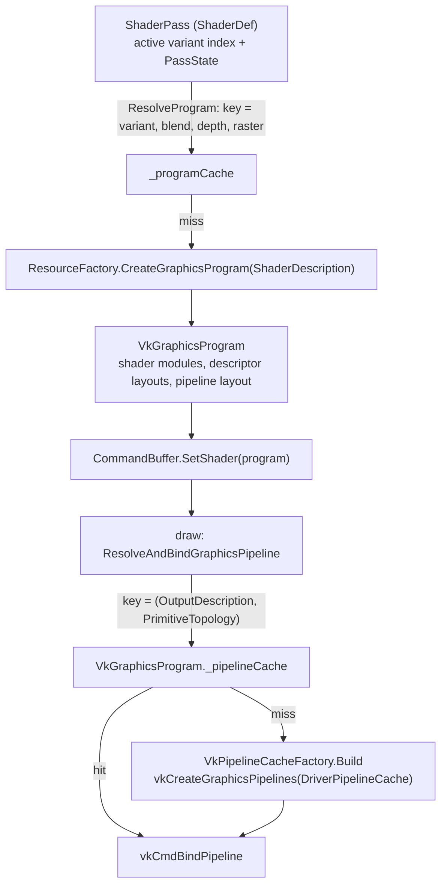

# Programs and Pipelines

How Graphite turns a compiled shader into something the GPU can draw with: the monolithic `GraphicsProgram`, the lazily built Vulkan pipelines hanging off it, and the layer above it that picks a program per shader variant.

- [Overview](#overview)
- [Key types](#key-types)
- [Control flow](#control-flow)
- [Design decisions](#design-decisions)
- [Gotchas](#gotchas)
- [See also](#see-also)

## Overview

Graphite has no separate "pipeline" object in its public API. A `GraphicsProgram` is the shader stages, the fixed-function state (blend, depth/stencil, rasterizer), the vertex input layouts and the resource layouts, all fixed at creation. What the program does not know is what it will render into (the framebuffer formats and sample count) or what primitive topology the mesh uses. Those are only known at draw time, so the Vulkan backend builds the actual `VkPipeline` lazily on the first draw that needs it and stores it in a per-program cache.

Above that, the optional ShaderDef layer (`ShaderPass`) owns a set of shader variants. Each variant, combined with a particular blend/depth/raster overlay, becomes its own `GraphicsProgram`. Variant selection is therefore a cache lookup in ShaderDef, not something Core or the backend knows about.

## Key types

| Type | Kind | Role |
|---|---|---|
| [ShaderProgram](../../Graphite/Core/Shader/ShaderProgram.cs#L8) | abstract class | Base of both program kinds. Owns cloned resource layouts and `SetBindingMetadata`. |
| [GraphicsProgram](../../Graphite/Core/Shader/GraphicsProgram.cs#L9) | abstract class | Stages + blend + depth/stencil + rasterizer + vertex layouts. Immutable after construction. |
| [ComputeProgram](../../Graphite/Core/Shader/ComputeProgram.cs#L5) | abstract class | One compute stage plus thread group size. |
| [ShaderDescription](../../Graphite/Core/Shader/ShaderDescription.cs#L8) | struct | Input to `CreateGraphicsProgram`. Equatable; never used as a cache key. |
| [ComputeDescription](../../Graphite/Core/Shader/ComputeDescription.cs#L8) | struct | Input to `CreateComputeProgram`. |
| [ShaderStageDescription](../../Graphite/Core/Shader/ShaderStageDescription.cs#L8) | struct | One compiled stage: `Stage`, `ShaderBytes` (SPIR-V), `EntryPoint`, `Debug`. |
| [SetBindingMetadata](../../Graphite/Core/Shader/SetBindingMetadata.cs#L7) | internal class | Per-set precomputation for binding: UBO order, same-named texture flags, uniform block slots. |
| [VkGraphicsProgram](../../Graphite/Platform/Vulkan/VkGraphicsProgram.cs#L8) | internal class | Vulkan program: shader modules, descriptor set layouts, pipeline layout, descriptor set cache, pipeline cache. |
| [VkPipelineCacheKey](../../Graphite/Platform/Vulkan/VkPipelineCacheKey.cs#L12) | internal struct | `(OutputDescription, PrimitiveTopology)`. |
| [VkPipelineCacheEntry](../../Graphite/Platform/Vulkan/VkPipelineCacheEntry.cs#L11) | internal struct | The `VkPipeline`, its compatibility render pass, and layout data copied from the program. |
| [VkPipelineCacheFactory](../../Graphite/Platform/Vulkan/VkPipelineCacheFactory.cs#L13) | internal static class | Builds a `VkPipelineCacheEntry` from program + key. |
| [VkComputeProgram](../../Graphite/Platform/Vulkan/VkComputeProgram.cs#L9) | internal class | Creates its compute pipeline eagerly in the constructor. |
| [ShaderPass](../../ShaderDef/Core/ShaderPass.cs#L11) | public class (ShaderDef) | Holds variants and a `_programCache` of `GraphicsProgram`s. |

## Control flow

### 1. Describing a program

A frontend (hand-written code or the ShaderDef compiler) fills a `ShaderDescription`: `Stages` with SPIR-V bytes, the three state structs, `VertexLayouts`, and `ResourceLayouts`. `ResourceFactory.CreateGraphicsProgram` runs `CreateGraphicsProgram_CheckDescription` (only when validation is on, see [the validation layer](../../Graphite/ValidationLayers/Core/ResourceFactory.Validation.cs#L143): at least one stage, no duplicate stage, feature support) and then calls the backend's `CreateGraphicsProgramCore` ([ResourceFactory.cs](../../Graphite/Core/ResourceFactory.cs#L156)).

### 2. Constructing the program

The `GraphicsProgram` constructor copies the stage kinds, the three state structs and a shallow clone of the vertex layouts. The `ShaderProgram` base constructor shallow-clones the resource layouts, deep-clones each element's `UniformFields`, and builds `SetBindingMetadata` ([ShaderProgram.cs](../../Graphite/Core/Shader/ShaderProgram.cs#L13)).

`VkGraphicsProgram`'s constructor ([source](../../Graphite/Platform/Vulkan/VkGraphicsProgram.cs#L82)) then:

1. Creates one `VkShaderModule` per stage and remembers each stage's entry point name.
2. Calls `VkDescriptorLayoutBuilder.Build` to make the descriptor set layouts, pipeline layout and per-set resource counts.
3. Creates a `VkDescriptorSetCache` for this program (see [resource binding](04-resource-binding.md)).

No `VkPipeline` exists yet.

### 3. Binding the program

`CommandBuffer.SetShader(GraphicsProgram)` ([source](../../Graphite/Core/CommandBuffer/CommandBuffer.State.cs#L11)) is a no-op when the same instance is already bound. Otherwise it calls `SetShaderCore`; on Vulkan that stores the program, adds its ref count to the command buffer's staging resources, and sets `_hasResolvedPipeline = false` ([VkCommandBuffer.State.cs](../../Graphite/Platform/Vulkan/VkCommandBuffer/VkCommandBuffer.State.cs#L52)).

### 4. Resolving the pipeline at draw time

Every draw goes through `ResolveAndBindGraphicsPipeline` ([source](../../Graphite/Platform/Vulkan/VkCommandBuffer/VkCommandBuffer.Draw.cs#L121)):

1. Read `IVertexSource.Topology` of the current vertex source. It is queried every draw and can change between calls.
2. If a pipeline is already resolved and the topology is unchanged, return. This is the command buffer's own one-entry fast path.
3. Build `VkPipelineCacheKey(framebufferOutputs, topology)`.
4. Call `VkGraphicsProgram.GetOrAddPipeline(key)` ([source](../../Graphite/Platform/Vulkan/VkGraphicsProgram.cs#L59)). Under a lock it returns the cached entry or calls `VkPipelineCacheFactory.Build`.
5. `vkCmdBindPipeline`.

The one-entry fast path is invalidated (`_hasResolvedPipeline = false`) by `SetShaderCore`, setting a framebuffer, and `ClearGraphicsState`. Changing the vertex source does not invalidate it; a source with a different topology misses the topology check in step 2.

### 5. Building a pipeline

`VkPipelineCacheFactory.Build` ([source](../../Graphite/Platform/Vulkan/VkPipelineCacheFactory.cs#L15)) assembles a `GraphicsPipelineCreateInfo` from three sources:

| Source | What it supplies |
|---|---|
| The program | Blend, rasterizer, depth/stencil state, vertex layouts, shader modules, pipeline layout |
| The key's `OutputDescription` | Color attachment count (blend attachments are padded up to it), sample count, a compatibility render pass |
| The key's `PrimitiveTopology` | Input assembly topology |

Viewport and scissor are the only dynamic states. Everything else is baked. The pipeline is created with `gd.DriverPipelineCache`, a single `VkPipelineCache` per device created empty at startup ([VkGraphicsDevice.cs](../../Graphite/Platform/Vulkan/VkGraphicsDevice/VkGraphicsDevice.cs#L86)). It only speeds up driver compilation within a run; it is not loaded from or saved to disk.

### 6. Teardown

`Dispose` drops a ref count. When the last reference goes, `DestroyNative` destroys every cached pipeline and its compatibility render pass, the descriptor set cache, the shader modules, and the descriptor/pipeline layouts. A pipeline therefore lives exactly as long as its program.

### 7. Compute programs

`VkComputeProgram` has no cache: its constructor creates the single `VkPipeline` immediately with `vkCreateComputePipelines`, because nothing about a compute dispatch varies the pipeline. `SetComputeShader` mirrors `SetShader`.

### 8. Variant selection above the program

ShaderDef's `ShaderPass.ResolveProgram` ([source](../../ShaderDef/Core/ShaderPass.cs#L325)):

1. Overlays the pass's `PassState` on the caller's base blend/depth/raster descriptions.
2. Looks up `ProgramKey(activeVariantIndex, blend, depth, raster)` in `_programCache`. A hit returns the existing `GraphicsProgram`.
3. On a miss it resolves the variant (compiling if needed), copies the compiled `ShaderDescription`, writes the three overlaid states into it, and calls `ResourceFactory.CreateGraphicsProgram`.

The full variant model is in [06-shader-compiler.md](06-shader-compiler.md). The point here is where the boundary sits: the backend sees only `GraphicsProgram`s and never a variant.

## Design decisions

### Why is pipeline state part of the program?

Vulkan needs the whole pipeline state at creation. Graphite keeps the state next to the shader so that one object describes everything that does not depend on the render target. The alternative (a separate pipeline object users combine with shaders) gives more flexibility but makes every call site assemble three things. The cost of this choice: a different blend mode on the same shader is a different `GraphicsProgram`, with its own modules and descriptor layouts.

### Why are outputs and topology not part of the program?

They are properties of the pass and the mesh, not the material. A shader drawn into an HDR target in one pass and an LDR target in another, or used with triangle lists and line lists, stays one program. The pipeline cache key carries exactly the state that varies per draw, and the compatibility render pass is part of each cache entry so it never needs to be rebuilt for a repeat key.

### Why a lock around the pipeline cache?

Two command buffers recorded on different threads can hit the same missing key at the same time. The lock prevents two `vkCreateGraphicsPipelines` calls for one key ([VkGraphicsProgram.cs](../../Graphite/Platform/Vulkan/VkGraphicsProgram.cs#L46)). The hit path also takes the lock; the per-command-buffer fast path exists so most draws never reach it.

### Why do programs clone their layouts?

`ShaderProgram` shallow-clones the layout array and deep-clones uniform field arrays, so the description a caller passes in can be reused or mutated afterwards without aliasing the program's copy.

### Why global uniform block slots?

`SetBindingMetadata` hands each element with loose uniform fields a process-unique slot from a static counter (or recycles one from a concurrent bag). That lets per-execution uniform caches be flat arrays indexed by slot instead of dictionaries keyed by block identity. Slots are returned in `OnDisposing`.

## Gotchas

- Creating a program does not deduplicate. `CreateGraphicsProgram` always constructs a new `VkGraphicsProgram`; nothing hashes `ShaderDescription`. `ShaderStageDescription.Equals` compares `ShaderBytes` by array reference, so two descriptions from separate compiles are never equal even with identical SPIR-V. Deduplication is the caller's job; ShaderDef does it with `_programCache`.
- The first draw with a new `(OutputDescription, PrimitiveTopology)` pair builds a pipeline on the recording thread, which adds a one-time delay to that draw.
- Blend attachments are padded: if the output has more color attachments than the program's `BlendState.AttachmentStates`, the last declared attachment state is reused for the extras, and with none declared they are blend-disabled.
- Vertex layouts are part of the program. Changing mesh layout means a different program, not a different key.
- Depth bias lives on `RasterizerStateDescription` (`DepthBiasEnabled`, `DepthBiasConstantFactor`, `DepthBiasSlopeFactor`, `DepthBiasClamp`). ShaderDef's `Offset <factor> <units>` maps factor to the slope factor and units to the constant factor.

## See also

- [API: Shader programs](../api/shader-programs.md)
- [API: ShaderDef file format](../api/shaderdef.md)
- [06 - Shader compiler](06-shader-compiler.md)
- [04 - Resource binding](04-resource-binding.md)
- [07 - Vulkan backend](07-vulkan-backend.md)
