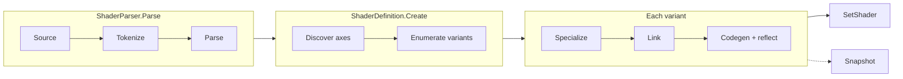

# Shader Compiler

How a `.shader` file becomes `ShaderDescription`s: tokenizer, parser, variant discovery, Slang compilation per backend, reflection, and the runtime that consumes the result.

- [Overview](#overview)
- [Key types](#key-types)
- [The whole workflow](#the-whole-workflow)
- [Control flow](#control-flow)
- [The variant and keyword model](#the-variant-and-keyword-model)
- [Design decisions](#design-decisions)
- [Gotchas](#gotchas)
- [See also](#see-also)

## Overview

ShaderDef is two assemblies. `ShaderDef` (Core) holds the parsed data model (`ShaderDefinition`, `ShaderPass`, `PassState`, `ShaderProperty`) and the variant runtime (`Variant`, `KeywordMap`, `KeywordState`). It has no dependency on Slang. `ShaderDef.Compiler` holds the parser and the only implementation of the `IShaderCompiler` seam, `SlangShaderCompiler`, which drives the native Slang compiler and one `CompilerModule` per target backend.

The split means a shipping build can link Core alone and play back `ShaderSnapshot`s baked earlier, while an editor or dev build links the compiler and compiles on demand.

The pipeline has two very different halves. Parsing is pure text handling with no Slang involved: the Slang source between `SLANGPROGRAM` and `ENDSLANG` is captured as an opaque string. Everything that needs to understand that string (entry points, variant axes, resource layouts) is done by Slang and its reflection API.

## Key types

| Type | Assembly | Role |
|---|---|---|
| [ShaderTokenizer](../../ShaderDef/Compiler/ShaderTokenizer.cs) | Compiler | Builds the Crumb tokenizer rules once; `Create(source)` returns a token stream. Captures the Slang block raw. |
| [ShaderParser](../../ShaderDef/Compiler/ShaderParser.cs#L103) | Compiler | `Parse(string)` -> `ShaderDefinition`. Also public: `ParsePass`, `ParsePassState`, `ParseProperty`. |
| [ParserUtility](../../ShaderDef/Compiler/ParserUtility.cs) | Compiler | Token helpers: keyword matching, numbers, enum-by-name, `SlangProgram` extraction. |
| [IShaderCompiler](../../ShaderDef/Core/IShaderCompiler.cs#L10) | Core | The seam: `GetAxes(pass)` and `Compile(pass, combo, backend)`. |
| [SlangShaderCompiler](../../ShaderDef/Compiler/SlangShaderCompiler.cs) | Compiler | Owns the Slang `Session`, registered `CompilerModule`s, and a per-pass `Prepared` cache. |
| [VariantReflection](../../ShaderDef/Compiler/VariantReflection.cs#L25) | Compiler | Finds `[VariantAxis]` externs through Slang reflection. |
| [VariantGenerator](../../ShaderDef/Compiler/VariantGenerator.cs#L12) | Compiler | Writes the Slang specialization module for one keyword combination. |
| [CompilerModule](../../ShaderDef/Compiler/CompilerModule.cs) | Compiler | Interface, one implementation per backend: Slang target plus reflection rules. |
| [VulkanCompiler](../../ShaderDef/Compiler/Platform/VulkanCompiler.cs) | Compiler | SPIR-V codegen and Vulkan descriptor-set reflection. The only working backend. |
| [SlangReflector](../../ShaderDef/Compiler/Platform/SlangReflector.cs#L14) | Compiler | Backend-independent reflection: stages, vertex inputs, uniform fields. |
| [ShaderDefinition](../../ShaderDef/Core/ShaderDefinition.cs) | Core | Parsed shader; `Create(...)` binds passes to a device. |
| [ShaderPass](../../ShaderDef/Core/ShaderPass.cs#L11) | Core | State, source, axes, variants, active keyword state, program cache. |
| [VariantCombos](../../ShaderDef/Core/VariantCombos.cs#L11) | Core | `Generate(axes)`: the Cartesian product as an odometer. |
| [KeywordMap](../../ShaderDef/Core/KeywordMap.cs) / [KeywordState](../../ShaderDef/Core/KeywordState.cs) | Core | Hash lookup over every combination. |
| [Variant](../../ShaderDef/Core/Variant.cs) | Core | One combination plus compiled `ShaderDescription`s per backend. Serializable, no compiler reference. |
| [ShaderSnapshot](../../ShaderDef/Core/ShaderSnapshot.cs) | Core | Serializable capture of axes and compiled variants. |

Metal, WebGPU and D3D11 compiler modules exist but are stubs: their `Backend` property and `CompileForTarget` throw `NotImplementedException`. `GraphicsBackend` has one value: `Vulkan`.

## The whole workflow



The top row runs once per file and needs no device. The middle block runs once per pass at `Create`. The compile block runs once per (combination, backend) and is skipped if a variant was loaded from a snapshot. The bottom row runs every time a pass is bound for drawing, and mostly hits a cache.

## Control flow

### 1. Tokenizing

[ShaderTokenizer.BuildRules](../../ShaderDef/Compiler/ShaderTokenizer.cs#L15) builds the rules once (they are immutable after `Compile()`) and every call to `Create` reuses them. The rules define whitespace, `//` and `/* */` comments, the symbols `{ } ( ) = ,` and a standalone `-`, quoted strings, numbers and identifiers. A leading minus is its own token and is folded back into the value by `ParserUtility.Integer` and `Float`.

The key rule is `.Block("SLANGPROGRAM", "ENDSLANG", ShaderToken.SlangProgram)`: everything between the markers becomes one token without being tokenized, so Slang syntax never has to be understood by this grammar. Markers are case-sensitive.

### 2. Parsing

[ShaderParser.Parse](../../ShaderDef/Compiler/ShaderParser.cs#L103) calls `ParseShader` ([L46](../../ShaderDef/Compiler/ShaderParser.cs#L46)) on a fresh tokenizer:

1. `Shader "Name"`, then `{`.
2. Optional `Properties { ... }`, parsed by `ParsePropertiesBlock`; duplicate property names throw.
3. Zero or more `Pass` blocks via `ParsePass` ([L154](../../ShaderDef/Compiler/ShaderParser.cs#L154)); at least one is required. Named passes must be unique.
4. Optional `Fallback "Name"`, then `}`; anything after the closing brace throws.

Inside a pass the order is fixed: optional integer index (parsed and discarded), optional `Name`, optional `Tags`, then render-state commands, then the Slang block. `ParsePassState` loops `TryParseRenderCommand` ([L343](../../ShaderDef/Compiler/ShaderParser.cs#L343)); each command produces a tiny `PassState` with only its fields set. `FromSeveral` ([L444](../../ShaderDef/Compiler/ShaderParser.cs#L444)) folds them with `PassState.Apply`, where earlier commands win per field. The loop stops at the first identifier it does not recognize; `ParsePass` then reports a leftover identifier as `Unknown command`, which is how typos like `Culll` surface.

Keyword matching for the structural words (`Shader`, `Pass`, `Name`, ...) ignores case. Command names and enum values do not: `TryParseRenderCommand` switches on exact names and values go through `Enum.TryParse` or an explicit map.

### 3. Binding and axis discovery

`ShaderDefinition.Create(device, compiler, fallback, mode)` ([source](../../ShaderDef/Core/ShaderDefinition.cs#L56)) calls `BindAll`, which for each pass asks `compiler.GetAxes(pass)` and then `ShaderPass.Bind`.

`SlangShaderCompiler.GetAxes` returns `Prepare(pass).Axes`. [Prepare](../../ShaderDef/Compiler/SlangShaderCompiler.cs#L186) runs once per `ShaderPass` instance per session and caches its result:

1. Loads the two always-present helper modules (`VariantAttributes`, which defines the `[VariantAxis]` attribute, and `UVOrigin`).
2. Loads the pass's `InlineSlang` as a module named after the pass (or `pass_N`).
3. `FindEntryPoints` collects the module's defined entry points, keeping one per stage. A pass with none throws `Shader pass contains no entrypoints.`
4. `VariantReflection.CollectVariantSpaces` finds the axes and the modules that must be linked.
5. Builds a composite of those modules plus the entry points. This `Prepared.Composite` is reused by every variant compile.

`CollectVariantSpaces` first calls `ScopeToImports` to drop modules the pass does not transitively import (the session is shared across shaders, so unrelated modules are loaded too). In each remaining module it looks for `extern` variables carrying a `VariantAxis` attribute (`TryGetAxis`). A `bool` becomes an axis with values `false`, `true`. An enum becomes an axis whose values are its case names, and records the module that declares the enum. Any other type throws. For enum axes, `EnsureEnumAccessible` loads a probe module to convert Slang's opaque "not accessible" error into one saying the enum must be `public`.

### 4. Expanding combinations

`ShaderPass.Bind` ([source](../../ShaderDef/Core/ShaderPass.cs#L55)) calls `VariantCombos.Generate(axes)`, producing every keyword combination (see the worked example below), allocates a `Variant?[]` slot array the same length, builds one `KeywordState` per combination and a `KeywordMap` over all of them, then selects combination 0 as active. If `CompileMode.All` was requested it calls `CompileAll`. Nothing is compiled otherwise.

### 5. Compiling one variant

`ShaderPass.Resolve(index)` ([source](../../ShaderDef/Core/ShaderPass.cs#L367)) returns the variant if it is already compiled for the device backend; otherwise, with a compiler attached, it calls `Compile(index)`, which calls `IShaderCompiler.Compile(this, combo, backend)` and stores the result in the `Variant` (creating it, or adding the backend to an existing one).

[SlangShaderCompiler.Compile](../../ShaderDef/Compiler/SlangShaderCompiler.cs#L168):

1. `Prepare(pass)` (cached) and `ModuleFor(backend, out layoutIndex)` to find the registered `CompilerModule`.
2. `CreateVariantModule`: `VariantGenerator.BuildSpecializationModule` writes a module with one `export public static const` per axis set to this combination's value, and imports the enum's declaring module if needed. The module is named `__Variant_<valueId>_<valueId>...`, so each combination gets a unique name.
3. `UvModule(backend is Vulkan)`: one of two tiny modules that export `IsUVOriginTopLeft` as `true` (Vulkan) or `false` (anything else). Shader code reads it with `import UVOrigin;`.
4. `CreateCompositeComponentType([prepared.Composite, variantModule, uvModule])`, then `Link()`. Linking is what resolves the shader's `extern` axis declarations against the exported constants.
5. `CompilerModule.CompileForTarget(linked, layoutIndex, handler)`.

`layoutIndex` is the module's position in the registered list; it matches the target order given to the Slang session in `BeginSession`, which is why `RegisterModule` must be called before `BeginSession`.

### 6. Per-backend reflection

`VulkanCompiler.CompileForTarget` ([source](../../ShaderDef/Compiler/Platform/VulkanCompiler.cs#L35)) does two things.

- `SlangReflector.BuildDescription(..., entryPointNameOverride: "main")` fetches SPIR-V for every entry point (`GetEntryPointCode`), maps Slang stages to `ShaderStages`, and reflects vertex shader inputs into `VertexLayoutDescription`s: one single-element layout per input, with location from the binding index and format from the scalar/vector type. All entry points are renamed `main`.
- `Reflect` walks Slang's parameter layout and groups elements by descriptor set into `ResourceLayoutDescription`s. `Collect` maps each resource to a set and binding (`DescriptorTableSlot`), detects combined image-samplers, and reflects uniform struct fields. A `ParameterBlock` becomes its own set, with its loose data collapsed into one implicit uniform buffer. Global loose uniforms become an element named `$Global` in set 0.

The returned `ShaderDescription` has default (zeroed) blend, depth and rasterizer state. Fixed-function state is deliberately not a compile-time concern; it is added when the pass is bound (see [05](05-programs-and-pipelines.md)).

### 7. Consumption at runtime

`CommandBufferExtensions.SetShader(cmd, pass, ...)` ([source](../../ShaderDef/Core/CommandBufferExtensions.cs)) calls `ShaderPass.ResolveProgram`, which overlays `PassState` onto base state, looks up or creates a `GraphicsProgram`, and hands it to `CommandBuffer.SetShader`. The compile in step 5 happens inside this call on first use when compiling on demand.

## The variant and keyword model

A **keyword** is a name/value pair: `Keyword("Lighting", "Baked")`. Names and values are interned to integers (`NameId`, `ValueId`) so comparing and hashing are integer operations. A **variant axis** (`VariantSpace`) is a name plus the list of values it can take. A **variant** is one fixed choice of value on every axis.

Axes are not declared in the shader markup. They come from the Slang source: an `extern static const` tagged `[VariantAxis]`. The shader author gets ordinary Slang constants to branch on, and the compiler turns each constant into a compile-time value per variant.

### Worked example: two axes, six variants

This is [EnumVariants.slang](../../Tests/ShaderDef.Compiler/Shaders/EnumVariants.slang) from the compiler tests:

```slang
import VariantAttributes;

module EnumVariants;

public enum Lighting { None, Baked, Realtime }

[VariantAxis]
extern static const Lighting LightingMode;

[VariantAxis]
extern static const bool Shadows;
```

`GetAxes` returns two `VariantSpace`s, in declaration order: `LightingMode` with values `None, Baked, Realtime` and `Shadows` with `false, true`. The variant count is the product of the value counts: 3 x 2 = 6.

`VariantCombos.Generate` counts like an odometer with the last axis varying fastest:

| Index | LightingMode | Shadows |
|---|---|---|
| 0 | None | false |
| 1 | None | true |
| 2 | Baked | false |
| 3 | Baked | true |
| 4 | Realtime | false |
| 5 | Realtime | true |

Index 0 is the default selection after `Bind`. Compiling index 5 generates this module:

```slang
module __Variant_12_14;
import EnumVariants;
export public static const Lighting LightingMode = Lighting.Realtime;
export public static const bool Shadows = true;
```

(The numbers in the module name are the interned value ids, so the exact digits vary.) Linked against the pass, `LightingMode` and `Shadows` are compile-time constants. Every variant is a complete, separate SPIR-V binary (the known-good outputs under `Tests/ShaderDef.Compiler/KnownGood` differ per combination); keywords are not runtime uniforms.

This grows multiplicatively. Ten axes of three values each is 59049 combinations, all of which `VariantCombos.Generate` allocates up front and `KeywordMap` hashes. Lazy compilation keeps the compile cost proportional to what is used, but the tables are sized by the full product.

### Selecting a variant at runtime

`KeywordState` keeps one `Keyword` per axis slot plus a 64-bit hash that is the XOR of each slot's `LongHash`. Changing a slot XORs out the old term and XORs in the new one, so updating is O(1) and allocation-free. `KeywordMap.Find` narrows by hash bucket, then confirms with `Matches`, because XOR folding collides for symmetric swaps such as `X=0,Y=1` versus `X=1,Y=0`.

`FindNearest` falls back to the state with the most matching slots (`MatchScore`, first best wins) if the exact lookup misses. Because `Bind` builds the map over every combination, not only compiled ones, a miss can only happen when a keyword has a known name but a value that no combination has (for example `"True"` for a bool axis, which uses lowercase). Nothing is thrown in that case; the pass quietly selects the nearest combination. Whether the chosen variant is compiled is decided afterwards by `Resolve`.

`Resolve` order, from [ShaderPass.cs](../../ShaderDef/Core/ShaderPass.cs#L367):

1. The variant exists and is compiled for this backend: use it.
2. A compiler is attached: try `Compile(index)`. On any exception, continue.
3. A variant object exists (wrong backend): return it.
4. The fallback variant is compiled for this backend: return it.
5. Otherwise throw `InvalidOperationException`.

A failed compile therefore degrades silently to the fallback, and is retried on every `Resolve`.

### Snapshots

`ShaderDefinition.Snapshot()` captures each pass's axes and whichever variants are populated. Reloading through `Create(device, snapshot)` restores them by looking each variant's keywords up in the `KeywordMap`; no compiler is needed and only those variants can resolve. Passing a compiler and fallback to the other overload allows gaps to be compiled on demand.

## Design decisions

### Why are axes declared in Slang, not the markup?

The Slang source is where the variant is actually used. Declaring the axis in a second place (markup) would mean keeping two lists in sync and inventing a way to express enum types. With `[VariantAxis]` on an `extern`, the type and the value list come from the same declaration the code branches on, and imported modules can contribute axes.

### Why synthesize a specialization module per combination instead of preprocessor defines?

Slang's module system and `static if` work on typed constants. Exporting constants that resolve an `extern` keeps enums and bools typed and works across module boundaries, where a macro would have to be threaded through every import. The cost is one extra tiny module load per combination.

### Why is the variant module name derived from value ids?

The Slang session caches loaded modules by name. If two combinations shared a name, every combination after the first would silently reuse the first one's constants. Naming by the interned value ids makes each combination's module unique ([CreateVariantModule](../../ShaderDef/Compiler/SlangShaderCompiler.cs#L255)).

### Why scope axes to a pass's imports?

The session (and its module cache) is reused across shaders to keep compiles fast, so `GetLoadedModule` enumerates modules from unrelated shaders. Only modules the pass transitively imports can define an axis it reads. `ScopeToImports` keeps a module if it cannot be identified at all, preferring an extra axis (more compile time) over dropping a live one (a wrong variant).

### Why is fixed-function state outside the compile?

`Cull`, `ZTest`, `Blend` and friends do not affect Slang output. Keeping them out of `Compile` means they do not multiply the number of Slang invocations, and `PassState` can be overlaid on caller-supplied base state at bind time. The compile result is backend-specific; the state is not.

### Why an interface seam (`IShaderCompiler`)?

Core must not depend on the native Slang library. Anything that only plays back baked variants never touches the Compiler assembly.

## Gotchas

- `ShaderDefinition.Create` with a compiler requires a `Variant fallback` argument. `new Variant()`, an empty variant with nothing compiled, means "throw if resolution fails".
- `RegisterModule` precedes `BeginSession`. `GetAxes` and `Compile` require an open session; without one, `Prepare` throws `Compile called before BeginSession!`. `BeginSession` and `EndSession` both clear the per-pass cache, and `EndSession` closes the session, after which on-demand compilation is unavailable.
- A `ShaderPass`'s keywords are mutable shared state. `SetKeyword` followed by `SetShader` is not thread-safe, and two users of the same pass with different keywords overwrite each other.
- Enum axis types must be `public`. A non-public enum fails at link time in a generated module; `EnsureEnumAccessible` reports this with a clear message instead.
- Only `bool` and enum axes are supported. Bool keyword values are the lowercase strings `"true"` and `"false"`.
- `SetKeyword` throws for an unknown axis name; `TrySetKeyword` returns false; `ApplyKeywords` skips unknown names and returns how many applied.
- Only the first blend attachment is written by `PassState.ToBlendState`. It replaces `AttachmentStates` with a single entry, so multi-target blend needs a hand-built program.
- `Offset <factor> <units>` becomes depth bias in `PassState.ToRasterizerState`: factor is the slope factor, units the constant factor. `Cull Off` works by setting `CullMode = None`; `PassState.EnableCulling` is never set by the parser.
- Shader `Properties` and `Fallback "name"` are parsed and stored on `ShaderDefinition`, but nothing in ShaderDef or Graphite consumes them. They are data for the consuming renderer or material system.
- `SlangShaderCompiler.Compile` is called from `ShaderPass.Resolve` on the thread that binds the shader, so the first draw of an uncompiled variant stalls command recording. `CompileMode.All`, `CompileAll()` and baked snapshots remove the stall.
- [SlangQuickCompile](../../Tools/SlangQuickCompile/Program.cs) reads `Tests/ShaderDef.Compiler/Shaders` and compares against `Tests/ShaderDef.Compiler/KnownGood`; `--write` updates the known-good outputs.

## See also

- [API: ShaderDef file format and compiler API](../api/shaderdef.md)
- [API: Shader programs](../api/shader-programs.md)
- [05 - Programs and pipelines](05-programs-and-pipelines.md)
- [Shader spec in the repo](../../ShaderDef/Core/ShaderSpec.md)
