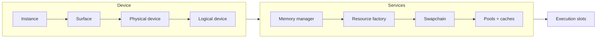
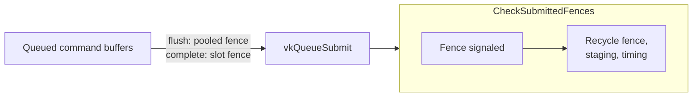
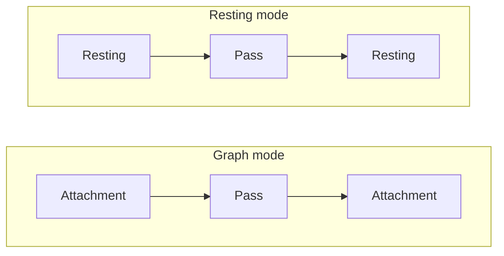

# Vulkan Backend

How `Platform/Vulkan` brings up Vulkan, submits work, allocates memory, caches descriptors, and drives the swapchain. Everything here is `internal`; it is the implementation behind the abstract Core types.

- [Key types](#key-types)
- [Initialization](#initialization)
- [Submission and fences](#submission-and-fences)
- [Command buffers](#command-buffers)
- [Image layouts and barriers](#image-layouts-and-barriers)
- [Memory](#memory)
- [Descriptors and pipelines](#descriptors-and-pipelines)
- [Swapchain and present](#swapchain-and-present)
- [Format mapping](#format-mapping)
- [Design decisions](#design-decisions)
- [Gotchas](#gotchas)
- [See also](#see-also)

## Overview

`VkGraphicsDevice` (a partial class spread over a dozen files) owns the `Instance`, `PhysicalDevice`, `Device`, one graphics queue (plus a present queue if the families differ), the memory manager, the descriptor machinery and the execution slots. Resources are plain wrappers around native handles, reference-counted where the GPU may outlive the managed object. The backend uses Silk.NET.Vulkan and targets Vulkan 1.0 core plus a handful of optional extensions.

## Key types

| Type | File | Role |
| --- | --- | --- |
| `VkGraphicsDevice` | [VkGraphicsDevice/](../../Graphite/Platform/Vulkan/VkGraphicsDevice) | Device, queues, submission, slots, staging, timing, debug markers |
| `VkResourceFactory` | [VkResourceFactory.cs](../../Graphite/Platform/Vulkan/VkResourceFactory.cs#L5) | Each `Create*Core` constructs the matching `Vk*` class |
| `VkExecutionTask` | [VkExecutionTask.cs](../../Graphite/Platform/Vulkan/VkExecutionTask.cs) | One execution: queued command buffers, slot arena |
| `VkUniformArena` | [VkUniformArena.cs](../../Graphite/Platform/Vulkan/VkUniformArena.cs) | Per-slot bump allocator for transient uniform data |
| `VkCommandBuffer` | [VkCommandBuffer/](../../Graphite/Platform/Vulkan/VkCommandBuffer) | Recording, pipeline resolve, render pass begin/end |
| `VkGraphCommandBufferPool` | [VkGraphCommandBufferPool.cs](../../Graphite/Platform/Vulkan/VkGraphCommandBufferPool.cs#L28) | Recycles graph command buffers |
| `VkTransferCommandBuffer` | [VkTransferCommandBuffer.cs](../../Graphite/Platform/Vulkan/VkTransferCommandBuffer.cs) | One-shot transfers, outside the ring |
| `VkDescriptorBinder` | [VkDescriptorBinder/](../../Graphite/Platform/Vulkan/VkDescriptorBinder) | Per-command-buffer resolve, cache lookup, bind |
| `VkDescriptorSetCache` | [VkDescriptorSetCache.cs](../../Graphite/Platform/Vulkan/VkDescriptorSetCache.cs) | Per-program cache of descriptor sets keyed by identity |
| `VkDescriptorPoolManager` | [VkDescriptorPoolManager.cs](../../Graphite/Platform/Vulkan/VkDescriptorPoolManager.cs) | Growable descriptor pools with per-set free |
| `VkDescriptorLayoutBuilder` | [VkDescriptorLayoutBuilder.cs](../../Graphite/Platform/Vulkan/VkDescriptorLayoutBuilder.cs) | Builds set layouts and the pipeline layout |
| `VkGraphicsProgram` / `VkComputeProgram` | [VkGraphicsProgram.cs](../../Graphite/Platform/Vulkan/VkGraphicsProgram.cs) | Shader modules, layouts, pipelines |
| `VkDeviceMemoryManager` | [VkDeviceMemoryManager/](../../Graphite/Platform/Vulkan/VkDeviceMemoryManager) | Chunked sub-allocator per memory type |
| `VkBuffer`, `VkTexture`, `VkTextureView`, `VkSampler` | [Platform/Vulkan/](../../Graphite/Platform/Vulkan) | Resource wrappers |
| `VkSwapchain`, `VkSwapchainFramebuffer` | [VkSwapchain.cs](../../Graphite/Platform/Vulkan/VkSwapchain.cs) | Presentation |
| `VkFramebuffer`, `VkFramebufferBase` | [VkFramebuffer.cs](../../Graphite/Platform/Vulkan/VkFramebuffer.cs) | Render targets and their render passes |
| `VkBarriers` | [VkBarriers.cs](../../Graphite/Platform/Vulkan/VkBarriers.cs) | Resting layouts, state to layout/stage/access mapping, barrier recording |
| `VkFormats` | [VkFormats/](../../Graphite/Platform/Vulkan/VkFormats) | Enum translation tables |
| `ResourceRefCount` | [ResourceRefCount.cs](../../Graphite/Platform/Vulkan/ResourceRefCount.cs) | Atomic refcount with a dispose callback |

## Initialization

The constructor ([VkGraphicsDevice](../../Graphite/Platform/Vulkan/VkGraphicsDevice/VkGraphicsDevice.cs#L29)) runs these steps in order:

1. **[CreateInstance](../../Graphite/Platform/Vulkan/VkGraphicsDevice/VkGraphicsDevice.Init.cs#L19).** Requests Vulkan API 1.0. Adds `VK_KHR_portability_enumeration` (and sets the enumerate-portability flag) when available, the surface extensions reported by the window's `IVkSurface`, `VK_KHR_get_physical_device_properties2` when present, and anything in `VulkanDeviceOptions.InstanceExtensions` (a missing one throws `RenderException`). With `GraphicsDeviceOptions.Debug` set it also enables `VK_EXT_debug_report` and whichever of `VK_LAYER_LUNARG_standard_validation` and `VK_LAYER_KHRONOS_validation` exist.
2. **[CreatePhysicalDevice](../../Graphite/Platform/Vulkan/VkGraphicsDevice/VkGraphicsDevice.Init.cs#L138).** Takes the first enumerated physical device. There is no selection API, so on multi-GPU systems the loader's ordering decides.
3. **[CreateLogicalDevice](../../Graphite/Platform/Vulkan/VkGraphicsDevice/VkGraphicsDevice.Init.cs#L171).** Finds a graphics queue family and a family that can present to the surface ([GetQueueFamilyIndices](../../Graphite/Platform/Vulkan/VkGraphicsDevice/VkGraphicsDevice.Init.cs#L338)); creates one queue from each distinct family. Enables every supported physical-device feature the GPU reports, then the extensions it finds: `VK_KHR_swapchain`, `VK_EXT_debug_marker`, `VK_KHR_maintenance1` (only when `PreferStandardClipSpaceYDirection`), `VK_KHR_get_memory_requirements2`, `VK_KHR_dedicated_allocation`, `VK_KHR_driver_properties`, `VK_EXT_memory_budget`, `VK_KHR_portability_subset`, plus `VulkanDeviceOptions.DeviceExtensions` (missing ones throw). Function pointers for optional extensions are loaded only when their dependencies are all present.
4. **Features.** `GraphicsDeviceFeatures` is filled from the physical-device feature struct; several are hard-coded `true` (compute, structured buffers, subset texture views, draw indirect, buffer range binding).
5. **Factory, frame options, swapchain, pools.** Then `InitializeFrameOptions`, the main `VkSwapchain` (if a description was supplied), descriptor pool manager, a graphics command pool, a driver `VkPipelineCache` (empty, not persisted), four shared command pools for staging, and finally `InitializeSlots` and `PostDeviceCreated` (see [02-device-and-execution.md](02-device-and-execution.md)).

## Submission and fences

All submissions go through one `GraphicsQueue` guarded by `_graphicsQueueLock`.

- **[SubmitExecutionBatch](../../Graphite/Platform/Vulkan/VkGraphicsDevice/VkGraphicsDevice.Submission.cs#L39)** takes the list of queued command buffers and either the slot fence (final submit) or a pooled fence (flush). It builds a single `SubmitInfo`, locks the queue, adds any pending swapchain acquire semaphores as waits (see [Swapchain and present](#swapchain-and-present)), submits, and appends a `FenceSubmissionInfo` per buffer. Only the last buffer of a pooled-fence batch has `OwnsFence` set, so the fence is returned exactly once.
- **[CheckSubmittedFences](../../Graphite/Platform/Vulkan/VkGraphicsDevice/VkGraphicsDevice.Submission.cs#L209)** polls in submission order and stops at the first unsignaled fence. It runs at the start of every submit and on `BeginExecutionCore`, and on `WaitForIdleCore`. There is no dedicated thread.
- **[CompleteFenceSubmission](../../Graphite/Platform/Vulkan/VkGraphicsDevice/VkGraphicsDevice.Submission.cs#L230)** notifies the command buffer, resolves GPU timing and pipeline-statistics queries into the profiler, resets and returns owned fences to the pool ([GetFreeSubmissionFence](../../Graphite/Platform/Vulkan/VkGraphicsDevice/VkGraphicsDevice.Submission.cs#L299)), and returns staging textures, staging buffers and shared command pools.
- **Transfers.** `SubmitTransferCore` goes through `SubmitCommandBuffer`, which tracks completion like other submissions. [SubmitAndWaitTransfer](../../Graphite/Platform/Vulkan/VkGraphicsDevice/VkGraphicsDevice.Submission.cs#L110) submits with a pooled fence and blocks on it immediately.
- **Acquire waits.** Every `vkQueueSubmit` on the graphics queue (execution batches, transfers, immediate uploads) first takes the pending acquire semaphore of every registered swapchain and waits on it at `ColorAttachmentOutput | Transfer`. A semaphore wait in a `vkQueueSubmit` also orders every later submission on the queue, so the first submit after an acquire covers the whole frame.
- After each `vkQueueSubmit` the code calls `FlushValidationErrors()` so debug-report messages are attributed to the submit that caused them.

Execution slots themselves (`SlotState`, `BeginExecutionCore`, `IsExecutionCompleteCore`) are covered in [02-device-and-execution.md](02-device-and-execution.md#the-execution-ring).

## Command buffers

Each `VkCommandBuffer` owns its own `CommandPool` (created with `ResetCommandBufferBit`) and primary command buffer. `Begin` ([source](../../Graphite/Platform/Vulkan/VkCommandBuffer/VkCommandBuffer.cs#L56)) resets or reallocates the native buffer, starts it with `OneTimeSubmit`, and starts the timing and pipeline-statistics query pools. `VkGraphCommandBufferPool` keeps wrappers on a free list: [Rent](../../Graphite/Platform/Vulkan/VkGraphCommandBufferPool.cs#L28) pops one or allocates; the execution task returns it when its slot is reused, and buffers that were never ended are disposed instead of recycled.

At draw time [PreDrawCommand](../../Graphite/Platform/Vulkan/VkCommandBuffer/VkCommandBuffer.Draw.cs#L77) does, in order: resolve the graphics pipeline ([ResolveAndBindGraphicsPipeline](../../Graphite/Platform/Vulkan/VkCommandBuffer/VkCommandBuffer.Draw.cs#L109)), `VkDescriptorBinder.Prepare` (which checks bound texture layouts), ensure a render pass is active, then emit the bind if anything changed. Compute does the same via `PreDispatchCommand` but first ends any active render pass, and after the dispatch returns any texture it moved to `General` for that dispatch to its resting layout.

## Image layouts and barriers

The backend stores no image layouts. [VkBarriers](../../Graphite/Platform/Vulkan/VkBarriers.cs) computes them:

| Input | Layout |
| --- | --- |
| Resting, swapchain image | `PresentSrcKhr` |
| Resting, `Sampled` | `ShaderReadOnlyOptimal` |
| Resting, `Storage` (not sampled) | `General` |
| Resting, `RenderTarget` / `DepthStencil` only | color / depth-stencil attachment optimal |
| Resting, anything else | `General` |
| `Sampled` / `Storage` / `Attachment` / `TransferSrc` / `TransferDst` / `DepthReadOnly` | `ShaderReadOnlyOptimal` / `General` / attachment optimal / `TransferSrcOptimal` / `TransferDstOptimal` / `DepthStencilReadOnlyOptimal` |

Each layout has one stage and access scope. Shader layouts use every shader stage the device enables (vertex, fragment, compute, plus geometry and tessellation when those features exist), attachment layouts use the attachment output and fragment test stages, transfer layouts use the transfer stage. A barrier is skipped only when old and new layouts are equal and read-only (`ShaderReadOnlyOptimal`, `TransferSrcOptimal`, `DepthStencilReadOnlyOptimal`, `PresentSrcKhr`); every other pair is emitted, so writes are always ordered.

Where layouts change:

- **Creation.** One immediate submit moves a new image from `Undefined` to its resting layout, clearing render targets and depth targets on the way through `TransferDstOptimal`.
- **Graph barriers.** The graph's barrier command buffers, and `RenderContext.Transition` on a pass's own command buffer, call `RecordBarriers`. It first applies clears still queued on the bound framebuffer, ends any open render pass, then emits one `vkCmdPipelineBarrier` with an image barrier per texture and at most one global memory barrier for buffers. A barrier out of `PresentSrcKhr` uses `ColorAttachmentOutput | Transfer` as its source stage so it chains with the acquire semaphore wait.
- **Copies, mip generation, resolves.** Each reads the current layout of its textures from the command buffer's graph state (resting for non-graph textures and for immediate uploads), transitions the touched subresources to transfer layouts, and transitions them back.
- **Storage binds.** A non-graph texture bound read-write whose resting layout is not `General` moves to `General` for one compute dispatch and back.

`VkFramebuffer` creates compatible render passes on first use ([GetRenderPass](../../Graphite/Platform/Vulkan/VkFramebuffer.cs#L41), [CreateRenderPass](../../Graphite/Platform/Vulkan/VkFramebuffer.cs#L52)): one per `FramebufferMode` (`Resting`, `Graph`, `GraphDepthReadOnly`), each with a load and a clear variant. The resting load pass is created with the framebuffer, which needs a render pass to be created against.

In graph mode every attachment enters and leaves in its attachment layout; the graph's barriers do the rest. `GraphDepthReadOnly` is graph mode with the depth attachment in `DepthStencilReadOnlyOptimal` for the whole pass, always loaded. In resting mode the attachment enters and leaves in its resting layout, so the render pass itself performs the transitions. Clear variants start from `Undefined`. [ResolveFramebufferMode](../../Graphite/Platform/Vulkan/VkCommandBuffer/VkCommandBuffer.RenderPass.cs#L123) picks the mode each time a render pass begins, so a `Transition` between two draws is seen: color in `Attachment` and depth in `Attachment` or `DepthReadOnly` means graph mode, all resting means resting mode, and anything else throws. A depth clear, queued or immediate, throws in `GraphDepthReadOnly`. The swapchain framebuffer is always resting mode. Both modes carry external subpass dependencies that order attachment access against earlier and later shader, transfer and attachment work.

## Memory

[VkDeviceMemoryManager](../../Graphite/Platform/Vulkan/VkDeviceMemoryManager/VkDeviceMemoryManager.cs) sub-allocates device memory:

- One `ChunkAllocatorSet` per memory type, in two dictionaries: persistently mapped and unmapped.
- Chunks are 64 MB for mapped memory and 256 MB for unmapped memory ([ChunkAllocator](../../Graphite/Platform/Vulkan/VkDeviceMemoryManager/VkDeviceMemoryManager.ChunkAllocator.cs#L13)).
- A request gets its own dedicated `vkAllocateMemory` when the caller asked for one (the driver said the resource prefers or requires it via `VK_KHR_dedicated_allocation`) or when the size is at least 64 MB (mapped) or 256 MB (unmapped). The dedicated path queries exact requirements again when the `*2` entry points exist.
- Non-dedicated sizes are rounded up to `bufferImageGranularity` so buffers and images sharing a chunk never alias a granularity page.
- Returned `VkMemoryBlock` structs carry the `DeviceMemory`, offset, size and the mapped pointer (null if unmapped).

Who uses which memory:

| Resource | Memory | Notes |
| --- | --- | --- |
| `VkBuffer` with `Dynamic` or `Staging` | HostVisible + HostCoherent, persistently mapped | Staging adds HostCached when a type exists |
| Other `VkBuffer` | DeviceLocal | Updated through staging buffers and copies |
| `VkTexture` (not `Staging`) | DeviceLocal, optimal tiling | Image created with mutable format (and cube-compatible for cubemaps), in its resting layout from creation on |
| `VkTexture` with `Staging` usage | A linear staging buffer, no image | Size is the sum of all mip levels |
| Per-slot transient arena | Dynamic uniform `VkBuffer`s | Overflow buffers recycled through a device-wide free list |

`VkBuffer` itself decides "dedicated" only from driver requirements; the size thresholds live in the manager ([Allocate](../../Graphite/Platform/Vulkan/VkDeviceMemoryManager/VkDeviceMemoryManager.cs#L42)). The buffer's [OrphanCore](../../Graphite/Platform/Vulkan/VkBuffer.cs#L127) re-runs `CreateNativeBuffer` and hands the old handle and block to a `RetiredNativeBuffer` disposable scheduled for when the in-flight execution completes.

## Descriptors and pipelines

Every `VkGraphicsProgram` and `VkComputeProgram` owns:

- a list of `DescriptorSetLayout`s built by [VkDescriptorLayoutBuilder.Build](../../Graphite/Platform/Vulkan/VkDescriptorLayoutBuilder.cs); gaps in declared set indices are filled with a shared empty layout so Vulkan set numbers are contiguous;
- a pipeline layout over those;
- a `VkDescriptorSetCache` with its own `VkDescriptorPoolManager`.

Graphics programs cache pipelines lazily in a dictionary keyed by [VkPipelineCacheKey](../../Graphite/Platform/Vulkan/VkPipelineCacheKey.cs) (the framebuffer `OutputDescription` and `PrimitiveTopology`); the first draw with a new combination builds one through `VkPipelineCacheFactory.Build` ([GetOrAddPipeline](../../Graphite/Platform/Vulkan/VkGraphicsProgram.cs#L59)). Compute programs create their single pipeline up front. Programs are ref-counted so native objects outlive in-flight submissions.

[VkDescriptorBinder.Prepare](../../Graphite/Platform/Vulkan/VkDescriptorBinder/VkDescriptorBinder.cs#L81) returns false, and draws nothing new, in two cases: the whole-draw fast path (same program and same property epoch as the last graphics draw in an active render pass) or when every set matches what is already bound. The identity for a set is a `ulong[]` built from the bound resources' identities including uniform buffer handles; because the transient uniform buffer differs per ring slot, each slot naturally gets its own descriptor set entries. Cached sets are byte-identical and never rewritten, which avoids touching a set the GPU may still be reading. Bind state is cleared at every new recording ([ClearForNewRecording](../../Graphite/Platform/Vulkan/VkDescriptorBinder/VkDescriptorBinder.cs#L68)), but packed uniform data lives on the execution's arena, so it is shared across the command buffers of one execution.

[VkDescriptorSetCache.Sweep](../../Graphite/Platform/Vulkan/VkDescriptorSetCache.cs#L94) is driven by `VkDescriptorSetCacheRegistry.SweepAll(executionId, MaxFramesInFlight)` at each `BeginExecutionCore`. Per set index it keeps the 32 most recently used entries regardless of age and frees older entries unused for more than `retention` executions. [VkDescriptorPoolManager](../../Graphite/Platform/Vulkan/VkDescriptorPoolManager.cs) creates pools of 1000 sets with 100 descriptors per type (uniform dynamic, sampled image, sampler, storage buffer, storage image, combined image sampler) using `FreeDescriptorSetBit`, and adds a pool when none has room. See [04-resource-binding.md](04-resource-binding.md) for how properties become identities.

## Swapchain and present

[VkSwapchain](../../Graphite/Platform/Vulkan/VkSwapchain.cs) is created with the device: it checks the surface is presentable from the graphics or present family, gets the present queue, creates a `VkSwapchainFramebuffer`, then creates the `VkSwapchainKHR` and does the first acquire. It registers with the device so submits can find its pending acquire semaphore.

| Choice | Rule |
| --- | --- |
| Surface format | `B8G8R8A8Srgb` if `ColorSrgb`, else `B8G8R8A8Unorm`, with sRGB-nonlinear color space. sRGB with no match throws; non-sRGB falls back to the first format. ([ChooseSurfaceFormat](../../Graphite/Platform/Vulkan/VkSwapchain.cs#L229)) |
| Present mode | vsync: FifoRelaxed if available else Fifo. No vsync: Mailbox, else Immediate, else Fifo. ([ChoosePresentMode](../../Graphite/Platform/Vulkan/VkSwapchain.cs#L261)) |
| Image count | `min(maxImageCount, minImageCount + 1)` |
| Extent | `CurrentExtent` when the surface defines it, else the requested size clamped to the surface limits. Zero-sized surfaces skip recreation. |
| Sharing | Concurrent if graphics and present families differ, else exclusive |
| Usage | `ColorAttachment` and `TransferDst` |

[AcquireNextImage](../../Graphite/Platform/Vulkan/VkSwapchain.cs) first applies a pending vsync change or recreation, then calls `vkAcquireNextImageKHR` with a semaphore and no fence, so the CPU never waits for the image. The semaphore becomes the swapchain's pending acquire and the next graphics-queue submit waits on it. Out-of-date results recreate the swapchain and retry; suboptimal results keep the image and recreate after it is presented. [SwapBuffersCore](../../Graphite/Platform/Vulkan/VkGraphicsDevice/VkGraphicsDevice.cs) submits an empty batch that waits on any pending acquire and signals the current image's present semaphore, presents waiting on that semaphore, then acquires the next image. Present runs under `_graphicsQueueLock` when the present queue is in the graphics family and the swapchain object otherwise, so two different queues never block each other. Recreating a swapchain first consumes any pending acquire, then calls `WaitForIdle`.

Semaphore reuse follows the image index. Each acquire semaphore is remembered against the image it acquired and returns to a free list when that image is acquired again: by then the present that read the image has completed, and so has every submit before it, including the one that waited on the old semaphore. Present semaphores are one per image and are reused the same way.

## Format mapping

`VkFormats` is a set of static conversion methods: `ToVkPixelFormat` (with a depth-stencil flag, in its own file), `ToVkTextureUsage`, `ToVkSamplerAddressMode`, `GetFilterParams`, blend factor and op, compare and stencil ops, cull mode, topology, vertex element formats, shader stages, index type, and the reverse `ToPixelFormat`. It is the only place Core enums meet Vulkan enums. Format capability queries go through [VkGraphicsDevice.FormatSupport](../../Graphite/Platform/Vulkan/VkGraphicsDevice/VkGraphicsDevice.FormatSupport.cs).

## Design decisions

### Why one queue and the first GPU?
All submissions use one graphics queue, so completion order equals submission order, which is why `CheckSubmittedFences` stops at the first unsignaled fence. The physical device is the first one enumerated.

### Why content-addressed descriptor sets?
Writing a descriptor set the GPU is reading is a hazard, and rewriting sets every draw is slow. Keying sets by the identity of everything bound lets identical bindings reuse a set forever and makes the frames-in-flight question disappear: a set is only ever written once, before first use.

### Why dedicated fences for slots plus a pooled fence list?
The slot fence tells the ring a whole execution is done. The pooled fences exist for intermediate flushes and transfers that are not tied to a slot. Using two kinds keeps the ring's invariants simple and gives the fence pool a single owner rule (`OwnsFence`).

### Why no layout tracker?
A tracker updated at record time is only right if record order matches submit order, and it hides which code owns a transition. Layouts are instead a pure function of usage (resting) or of the graph's declared state, so every transition has a known owner and nothing needs to be kept in sync.

### Why keep VkRenderPass instead of dynamic rendering?
MoltenVK and older Android drivers are targets, so the backend stays on core Vulkan 1.0 render passes. Up to three layout modes times two load variants exist per framebuffer; they are render-pass compatible, so one framebuffer and one pipeline serve all of them.

### Why one command pool per command buffer?
Vulkan command pools are externally synchronised, so a pool per buffer means two buffers never share a pool and can be recorded independently. Each wrapper is created with `ResetCommandBufferBit` so its native buffer can be reset and reused. The cost is one pool object per wrapper, which is why `VkGraphCommandBufferPool` recycles the wrappers themselves.

## Gotchas

- Device selection is fixed: the first physical device the loader enumerates.
- Validation layers are enabled only when `GraphicsDeviceOptions.Debug` is true and a layer is installed; they are unrelated to Graphite's own `EnableValidation`.
- Transient uniform memory is reused every `MaxFramesInFlight` executions; a range is invalid after its execution completes.
- `SwapBuffers` does not wait on the GPU for the next image. `vkAcquireNextImageKHR` itself can still block when every image is queued for presentation, which is where vsync throttling shows up.
- The driver pipeline cache is created empty and never saved, so pipeline creation cost is paid at every process start.
- A `VkTexture` with `Staging` usage has no `VkImage` (only a staging buffer).
- A texture created from a native handle (`ResourceFactory.CreateTexture(ulong, ...)`) is treated like a swapchain image: its resting layout is `PresentSrcKhr` and it is cleared on creation.
- Binding a framebuffer that mixes graph attachments with non-graph textures, or whose graph texture was declared with a non-`Attachment` kind, throws `RenderException`.
- Surface lost (`ErrorSurfaceLostKhr`) throws `RenderException`; there is no automatic recovery.
- The present queue and graphics queue use separate locks only when they differ; code that submits from several threads still serialises on the graphics queue lock.

## See also

- [01-architecture.md](01-architecture.md), [02-device-and-execution.md](02-device-and-execution.md), [04-resource-binding.md](04-resource-binding.md), [05-programs-and-pipelines.md](05-programs-and-pipelines.md), [08-validation-and-profiling.md](08-validation-and-profiling.md)
- API: [graphics-device](../api/graphics-device.md), [buffers-and-textures](../api/buffers-and-textures.md), [command-buffers](../api/command-buffers.md)
