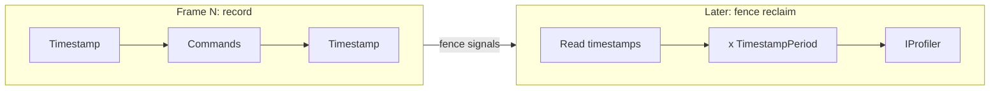

# Validation and Profiling Internals

How Graphite's two optional diagnostic layers are wired into the core, what they check, and what they measure.

- [Overview](#overview)
- [Key types](#key-types)
- [Control flow](#control-flow)
- [Design decisions](#design-decisions)
- [See also](#see-also)

## Overview

Graphite ships two independent diagnostic layers that live in their own folders but are compiled into the same assembly as the rest of the library:

- The validation layer ([ValidationLayers/](../../Graphite/ValidationLayers/)) is a set of argument and state checks that throw `RenderException` on misuse, before the bad call reaches the backend.
- The profiling layer ([Profiling/](../../Graphite/Profiling/)) is an event sink (`IProfiler`) that the core and the Vulkan backend feed with allocations, pass and draw events, barriers, and GPU timings.

Neither layer is a separate assembly or a `#if`. Both work through `partial` classes: the core type declares a call such as `Map_CheckResource(...)` or reads `Profiler`, and the implementation lives in a `*.Validation.cs` or `*.Profiling.cs` file next to a matching folder. Each layer has one runtime gate, so the cost when off is one static bool read or one null check.

## Key types

| Type | File | Role |
|------|------|------|
| `GraphicsDevice.ValidationEnabled` | [GraphicsDevice.Validation.cs](../../Graphite/ValidationLayers/Core/GraphicsDevice/GraphicsDevice.Validation.cs#L8) | Single static gate for every validation check |
| `ValidationHelpers` | [ValidationHelpers.cs](../../Graphite/ValidationLayers/Core/ValidationHelpers.cs#L5) | Shared null, copy-range and texture-region checks (internal) |
| `ResourceFactory` validation partial | [ResourceFactory.Validation.cs](../../Graphite/ValidationLayers/Core/ResourceFactory.Validation.cs) | Description checks for every `Create*` |
| `CommandBuffer` validation partial | [CommandBuffer.Validation.cs](../../Graphite/ValidationLayers/Core/CommandBuffer/CommandBuffer.Validation.cs) | Draw, clear, viewport and indirect checks |
| `ExecutionTask` validation partial | [ExecutionTask.Validation.cs](../../Graphite/ValidationLayers/Core/ExecutionTask/ExecutionTask.Validation.cs#L16) | Transient hard cap check |
| `ResourceRefCount` validation partial | [ResourceRefCount.Validation.cs](../../Graphite/ValidationLayers/Platform/Vulkan/ResourceRefCount.Validation.cs) | Use-after-dispose detection |
| `IProfiler` | [IProfiler.cs](../../Graphite/Profiling/Core/IProfiler.cs#L5) | The sink interface users implement |
| `GraphicsDevice.Profiler` / `SetProfiler` | [GraphicsDevice.Profiling.cs](../../Graphite/Profiling/Core/GraphicsDevice/GraphicsDevice.Profiling.cs#L9) | Holds the active profiler, fans buffer allocations into role bins |
| `ProfilerTypes` | [ProfilerTypes.cs](../../Graphite/Profiling/Core/ProfilerTypes.cs) | Readonly structs passed to the profiler (`PassInfo`, `DrawCallInfo`, ...) |
| `MemoryBudgetInfo` | [GraphicsDevice.MemoryBudget.cs](../../Graphite/Profiling/Core/GraphicsDevice/GraphicsDevice.MemoryBudget.cs) | Driver-reported VRAM budget query |
| `Vk*.Profiling.cs` | [Profiling/Platform/Vulkan/](../../Graphite/Profiling/Platform/Vulkan/) | Per-resource allocation accounting for the Vulkan backend |
| Vulkan debug callback | [VkGraphicsDevice.DebugMarkers.cs](../../Graphite/Platform/Vulkan/VkGraphicsDevice/VkGraphicsDevice.DebugMarkers.cs#L77) | Third diagnostic source: the driver's own validation layers |

## Control flow

### 1. Both layers are configured once, in the device constructor

Every backend constructor calls [`InitializeFrameOptions`](../../Graphite/Core/GraphicsDevice/GraphicsDevice.Execution.cs#L210). After it sizes the execution ring and transient caps, it calls two partial methods:

- `InitializeFrameOptions_SetValidationEnabled` sets `ValidationEnabled = options.GraphiteValidation`. Validation is on unless `GraphiteValidation` is `false`.
- `InitializeFrameOptions_InitializeProfiling` copies `options.Profiler` into the `Profiler` property.

### 2. Validation: check-then-act at the public boundary

Every public entry point that validates follows one shape: call a `*_Check*` partial method first, then the `*Core` backend method. Each check begins with `if (!ValidationEnabled) return;`, so disabling validation skips only the checks, never the work. Examples of the call sites:

| Entry point | Check called | What it rejects |
|-------------|--------------|-----------------|
| `ResourceFactory.CreateTexture` | `CreateTexture_CheckDescription` | zero dimensions, bad usage combinations, unsupported MSAA or 1D, `GenerateMipmaps` with `DepthStencil` |
| `ResourceFactory.CreateBuffer` | `CreateBuffer_CheckDescription` | bad structured stride, missing features, illegal `Staging`/`Dynamic` mixes, uniform size not a multiple of 16 |
| `ResourceFactory.CreateGraphicsProgram` | `CreateGraphicsProgram_CheckDescription` | no stages, duplicate stages, missing vertex stage, bad vertex layout, bad resource layouts |
| `ResourceFactory.CreateSampler` / `CreateTextureView` / `CreateComputeProgram` | matching `_CheckDescription` | unsupported LOD bias or anisotropy, bad mip/layer range, missing compute feature |
| `GraphicsDevice.Map` | `Map_CheckResource` | buffer without `Dynamic` or `Staging`, read modes on non-`Staging` buffers, texture without `Staging`, subresource out of range |
| `GraphicsDevice.UpdateTexture` | `UpdateTexture_CheckParameters` | bad compressed-format alignment, wrong byte size, out-of-bounds region |
| `GraphicsDevice.SubmitAndWait` | `SubmitAndWait_CheckEnded` | transfer buffer not `End()`ed |
| `ExecutionTask` submit (Vulkan) | `SubmitCommands_CheckEnded` | command buffer not `End()`ed |
| `CommandBuffer.Draw*` | `Draw_PreDrawValidation` | no shader, no framebuffer, or no vertex source set |
| `CommandBuffer.DrawIndirect*` | `DrawIndirect_Check{Support,Buffer,Offset,Stride}` | missing feature, buffer without `IndirectBuffer`, offset or stride not 4-byte aligned |
| `CommandBuffer.ClearColorTarget` / `ClearDepthStencil` | `Clear*_CheckFramebuffer` | no framebuffer, index out of range, no depth target |
| `CommandBuffer.ResolveTexture` | `ResolveTexture_CheckSampleCounts` | source not multisampled, or destination multisampled |
| `FramebufferAttachmentDescription` ctor | `FramebufferAttachmentDescription_CheckLayerAndMip` | layer or mip past the texture |
| `ResourceRefCount.Increment` | `Increment_CheckNotDisposed` | referencing a disposed resource |

The broad null checks (`ValidationHelpers.RequireNotNull`) are used by `DispatchGraph`, the execution API, `PropertySet.Set*`, and the copy methods. The copy methods also call `CopyBufferCheckRange` and the `CopyTextureCheck*` family from [CommandBufferBase.cs](../../Graphite/Core/CommandBuffer/CommandBufferBase.cs#L88).

One check lives in the Vulkan backend rather than the core: the transient hard cap. [`VkExecutionTask.CheckCumulativeCaps`](../../Graphite/Platform/Vulkan/VkExecutionTask.cs#L97) runs only when the per-execution bump arena grows, calls the validation helper for the hard cap (throws), and separately raises the soft cap through `OnWarning` (not gated by validation).

### 3. Profiling: a null-guarded event stream

The device exposes `Profiler` and the core and backend call it with `?.`. During `DispatchGraph`, [`DispatchGraph`](../../Graphite/Core/RenderGraph/GraphicsDevice.DispatchRenderGraph.cs#L35) brackets each view and [`RenderPipeline.ExecuteView`](../../Graphite/Core/RenderGraph/RenderPipeline.cs#L97) brackets each pass. The present pass is not wrapped in `BeginPass`/`EndPass`; only the ordered graph passes are.

Event sources, grouped by where the call is made:

| Group | Events | Raised from |
|-------|--------|-------------|
| Resource accounting | `Allocate`, `Free`, `AllocateMemory`, `FreeMemory` | `RecordBufferAllocation` in the device partial, `Vk*.Profiling.cs`, and Vk constructors/disposers ([VkTexture.Profiling.cs](../../Graphite/Profiling/Platform/Vulkan/VkTexture.Profiling.cs) stores `_profiledBytes` so the free replays the same number) |
| Buffer traffic | `Record(BufferOpBin.Map/Unmap/Update/Copy)` | `GraphicsDevice.Map/Unmap/UpdateBuffer/UpdateTexture`, Vulkan copy |
| Swapchain | `RecordSwap(Present/Resize/Acquire)` | `GraphicsDevice.SwapBuffers`, `VkSwapchain` |
| Barriers | `RecordBarrier(TextureTransition/BufferTransition/MemoryBarrier)` | `VkBarriers` (graph barrier batches and command-local transitions), `VkCommandBuffer` / `VkTransferCommandBuffer` buffer copies |
| Structure | `BeginView/EndView`, `BeginPass/EndPass`, `RecordPassRead` | `DispatchGraph`, `ExecuteView` |
| Commands | `RecordPipelineSwitch`, `RecordDraw`, `RecordDispatch`, `RecordResourceSetBind`, `RecordSubmit` | `CommandBuffer.State/Draw`, `VkExecutionTask`, `SubmitAndWait` |
| Opt-in extras | `RecordPassMetadata`, `RecordDrawMetadata`, `RecordDrawBuffers`, `Capture` | `RenderContext`, `CommandBuffer.Profiling`, `ExecuteView` |
| GPU numbers | `RecordExecutionTime`, `RecordGpuVertexStats` | `VkGraphicsDevice.Submission` when the submission fence completes |

### 4. GPU timing is pulled, not pushed

Three `Request*` properties on `IProfiler` decide whether extra work is done at all:

| Property | If true, Graphite also does |
|----------|------------------------------|
| `RequestMetadata` | lets `RenderContext.WantsMetadata` and `CommandBuffer.WantsMetadata` return true, so user code builds metadata objects |
| `RequestGPUStatistics` | brackets each submission with a two-query timestamp pool ([BeginTiming](../../Graphite/Platform/Vulkan/VkGraphicsDevice/VkGraphicsDevice.Timing.cs#L16)), and a pipeline-statistics query when the physical device supports it ([PipelineStats](../../Graphite/Platform/Vulkan/VkGraphicsDevice/VkGraphicsDevice.PipelineStats.cs#L32)) |
| `RequestCapture` | captures vertex/index/bound buffers at each draw, and copies every pass's output framebuffers through a transfer command buffer after the pass |

The timestamps are written while recording. They are read back in [`CompleteFenceSubmission`](../../Graphite/Platform/Vulkan/VkGraphicsDevice/VkGraphicsDevice.Submission.cs#L242), after the submission's fence has signaled, so reading them never stalls the GPU. That is why `RecordExecutionTime` and `RecordGpuVertexStats` arrive some frames after the work was recorded, not inside the pass scope.

### 5. The third layer: Vulkan's own validation

`GraphicsDeviceOptions.VulkanValidationLayers` is unrelated to `GraphiteValidation`. When `VulkanValidationLayers` is true, the Vulkan instance enables `VK_EXT_debug_report` and whichever of the standard or Khronos validation layers are installed ([Init.cs](../../Graphite/Platform/Vulkan/VkGraphicsDevice/VkGraphicsDevice.Init.cs#L88)). The driver callback cannot throw across the unmanaged boundary, so it stores the last error string and returns; the next call to [`FlushValidationErrors`](../../Graphite/Platform/Vulkan/VkGraphicsDevice/VkGraphicsDevice.DebugMarkers.cs#L77) (after a submit, after `WaitForIdle`) turns it into a `RenderException`. Warnings are printed to the console immediately.

## Design decisions

### Why a static bool instead of `#if` or a per-device flag?

A single `static bool` read is cheap enough to leave the checks compiled into release builds, which lets an application turn validation off or on from options without shipping two builds. Checks that have no device in scope (static helpers such as `Map_CheckResource`, description structs like `FramebufferAttachmentDescription`, `ResourceRefCount`) could not consult a per-device flag anyway.

### Why partial classes per layer?

It keeps the core file readable: the public method shows `Map_CheckResource(...)` and the body of the rules lives in `ValidationLayers/`. The same pattern puts Vulkan allocation accounting in `Profiling/Platform/Vulkan/` instead of cluttering `VkTexture`. Deleting a folder is a mechanical way to see what each layer costs.

### Why is the profiler an interface with structs, not events?

All payloads (`PassInfo`, `DrawCallInfo`, `CommandBufferInfo`, ...) are `readonly struct` passed by `in`, so a profiler sees millions of draw events without allocating. `CommandBufferInfo` carries a numeric `Id` rather than the command buffer because command buffers are pooled; the id is fresh per rental, while the object would be reused under you.

### Why `Request*` flags?

GPU queries, buffer captures and deep copies are expensive. The profiler declares what it needs and the backend only does that work when asked. A counting profiler can return false from all three and pay only for the cheap event calls.

### Why are the two layers independent?

The profiler receives events whether or not validation is on, and validation never consults the profiler. You can profile a release-configured device with validation off, or validate with no profiler.

## See also

- [Diagnostics API](../api/diagnostics.md) for the user-facing options and an `IProfiler` example
- [Device and execution internals](02-device-and-execution.md) for the execution ring, fences and transient caps the checks refer to
- [Render graph internals](03-render-graph.md) for pass ordering behind `BeginPass`/`EndPass`
- [Vulkan backend internals](07-vulkan-backend.md) for submission and fence reclaim
